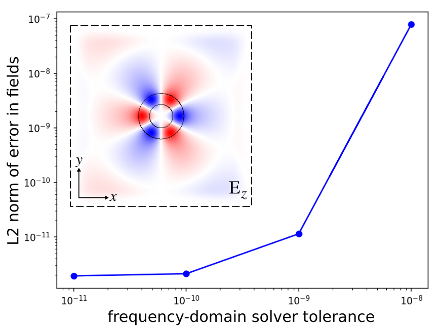

---
# Frequency Domain Solver
---

This tutorial demonstrates Meep's [frequency-domain solver](../Scheme_User_Interface/#frequency-domain-solver) which is used to compute the fields produced in a geometry in response to a [constant-frequency source](https://en.wikipedia.org/wiki/Continuous_wave). For more details regarding what this feature is and how it works, refer to this [FAQ](../FAQ/#what-is-meeps-frequency-domain-solver-and-how-does-it-work). This example involves using the frequency-domain solver to compute the fundamental mode of a ring resonator which has been described in a [separate tutorial](Basics/#modes-of-a-ring-resonator). We will verify that the error in the computed fields decreases monotonically with decreasing tolerance of the iterative solver.

Only two changes are necessary to the [original script](https://github.com/stevengj/meep/blob/master/scheme/examples/ring.ctl) which involved time-stepping the fields in response to a broadband source: (1) replace the Gaussian-pulse source with a [continuous-wave (CW) source](../Scheme_User_Interface/#source), and (2) turn on complex fields since, by default, real fields are used. Everything else remains unchanged.

Since the frequency-domain solver uses an [iterative method](https://en.wikipedia.org/wiki/Iterative_method), there are two things we can do to improve its convergence: (1) use a non-zero smoothing width (default is 0) for the CW source to reduce the high-frequency oscillations produced by its abrupt turn on (which have slow group velocities and are absorbed poorly by [PML](../Perfectly_Matched_Layer/)), and (2) increase the value of $L$ (default is 2) which is one of the parameters used in the [BiCGSTAB-L](https://en.wikipedia.org/wiki/Biconjugate_gradient_stabilized_method) iterative solver.

We will use the frequency-domain solver to compute the fields at five different tolerance values on a logarithmic scale. We will plot the L2 norm of the difference of the fields at the first four tolerances with the fields at the lowest tolerance as a function of the tolerance. The simulation script and the resulting plot are shown below.

```scm
(define-param n 3.4)
(define-param w 1)
(define-param r 1)
(define-param pad 4)
(define-param dpml 2)

(define sxy (* 2 (+ r w pad dpml)))

(set! geometry-lattice (make lattice (size sxy sxy no-size)))

(set! geometry (list
                (make cylinder (center 0 0) (height infinity)
                               (radius (+ r w)) (material (make dielectric (index n))))
                (make cylinder (center 0 0) (height infinity)
                               (radius r) (material air))))

(set! pml-layers (list (make pml (thickness dpml))))
(set-param! resolution 10)

(define-param fcen 0.15)
(define-param df 0.08)
(set! sources (list
               (make source
                  (src (make continuous-src (frequency fcen) (fwidth df)))
                  (component Ez) (center (+ r 0.1) 0))))

(set! symmetries (list (make mirror-sym (direction Y))))

(set! force-complex-fields? true)

(define-param solve-cw-tol 1e-8)
(define-param solve-cw-maxiters 10000)
(define-param solve-cw-L 10)

(init-fields)
(meep-fields-solve-cw fields solve-cw-tol solve-cw-maxiters solve-cw-L)
(in-volume (volume (center 0 0) (size (- sxy (* 2 dpml)) (- sxy (* 2 dpml))))
           (output-epsilon)
           (output-efield-z))

(exit)
```

The inset of the figure below shows the scalar E$_z$ field, computed using a tolerance of 10$^{-12}$, overlapping the ring-resonator geometry. The error in the fields decreases monotonically with decreasing tolerance of the frequency-domain solver.

<center>

</center>