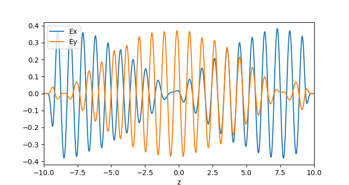

---
# Gyrotropic media
---

In this example, we will perform simulations with gyrotropic media. See [Materials](../Materials.md#gyrotropic-media) for more information on how gyrotropy is supported.

[TOC]

### Faraday Rotation

Consider a uniform gyroelectric medium with bias vector $\mathbf{b} = b \hat{z}$. In the frequency domain, the *x* and *y* components of the dielectric function have the form

$$\epsilon = \begin{bmatrix}\epsilon_\perp & -i\eta \\ i\eta & \epsilon_\perp \end{bmatrix}$$

The skew-symmetric off-diagonal components in ε give rise to [Faraday rotation](https://en.wikipedia.org/wiki/Faraday_effect): when a plane wave linearly polarized along *x* is launched along the gyrotropy axis *z*, the polarization vector will precess around the gyrotropy axis as the wave propagates. This is the principle behind [Faraday rotators](https://en.wikipedia.org/wiki/Faraday_rotator), devices that act as one-way valves for light.

A plane wave undergoing Faraday rotation can be described by the complex ansatz

$$\begin{bmatrix}E_x \\ E_y\end{bmatrix} = E_0 \begin{bmatrix}\cos(\kappa_c z) \\ \sin(\kappa_c z)\end{bmatrix} e^{i(kz-\omega t)}$$

where $\kappa_c$ is the Faraday rotation (in radians) per unit of propagation distance. Substituting this into the frequency domain Maxwell's equations, with the above dielectric tensor, yields

$$|\kappa_c| = \omega \sqrt{\frac{\mu}{2} \, \left(\epsilon_\perp - \sqrt{\epsilon_\perp^2 - \eta^2}\right)}$$

We model this phenomenon in the simulation script [faraday-rotation.ctl](https://github.com/NanoComp/meep/blob/master/scheme/examples/faraday-rotation.ctl). First, we define a gyroelectric material:

```(define-param epsn 1.5)    ; background permittivity
(define-param f0 1.0)      ; natural frequency
(define-param g0 1e-6)     ; damping rate
(define-param sn 0.1)      ; sigma parameter
(define-param b0 0.15)     ; magnitude of bias vector

(set! default-material
      (make dielectric
	(epsilon epsn)
	(E-susceptibilities
	 (make gyrotropic-lorentzian-susceptibility
	   (frequency f0)
	   (sigma sn)
	   (gamma g0)
	   (bias (vector3 0 0 b0))))))
```

The `gyrotropic-lorentzian-susceptibility` object has a `bias` argument that takes a `vector3` specifying the gyrotropy vector. In this case, the vector points along *z*, and its magnitude (which specifies the precession frequency) is determined by the variable `b0`. The other arguments play the same role as in an ordinary (non-gyrotropic) [Lorentzian susceptibility](Material_Dispersion.md).

Next, we set up and run the Meep simulation.

```(define-param tmax 100)
(define-param L 20.0)
(define-param fsrc 0.8)
(define-param src-z -8.5)
(set-param! resolution 50)

(set! geometry-lattice (make lattice (size 0 0 L)))

(set! pml-layers (list (make pml (thickness 1.0) (direction Z))))

(set! sources (list
	       (make source
		 (src (make continuous-src (frequency fsrc)))
		 (component Ex)
		 (center (vector3 0 0 src-z)))))

(run-until tmax
	   (to-appended "efields"
			(at-end output-efield-x)
			(at-end output-efield-y)))
```

The simulation cell is one pixel wide in the *x* and *y* directions, with periodic boundary conditions. PMLs are placed in the *z* direction. A `ContinuousSource` emits a wave whose electric field is initially polarized along *x*.

After running the simulation, the `ex` and `ey` datasets in `faraday-rotation-efields.h5` contain the values of $\mathbf{E}_x$ and $\mathbf{E}_y$. These are plotted against *z* in the figure below:

<center>

</center>

We see that the wave indeed rotates in the *x*-*y* plane as it travels.

Moreover, we can compare the Faraday rotation rate in these simulation results to theoretical predictions. In the [gyrotropic Lorentzian model](../Materials.md#gyrotropic-media), the ε tensor components are given by

$$\epsilon_\perp = \epsilon_\infty + \frac{\omega_n^2 \Delta_n}{\Delta_n^2 - \omega^2 b^2}\,\sigma_n(\mathbf{x}),\;\;\; \eta = \frac{\omega_n^2 \omega b}{\Delta_n^2 - \omega^2 b^2}\,\sigma_n(\mathbf{x}), \;\;\;\Delta_n \equiv \omega_n^2 - \omega^2 - i\omega\gamma_n$$

From these expressions, we can calculate the rotation rate $\kappa_c$ at the operating frequency, and hence find the $\mathbf{E}_x$ and $\mathbf{E}_y$ field envelopes for the complex ansatz given at the top of this section. As shown in the figure below, the results are in excellent agreement:

<center>

</center>
