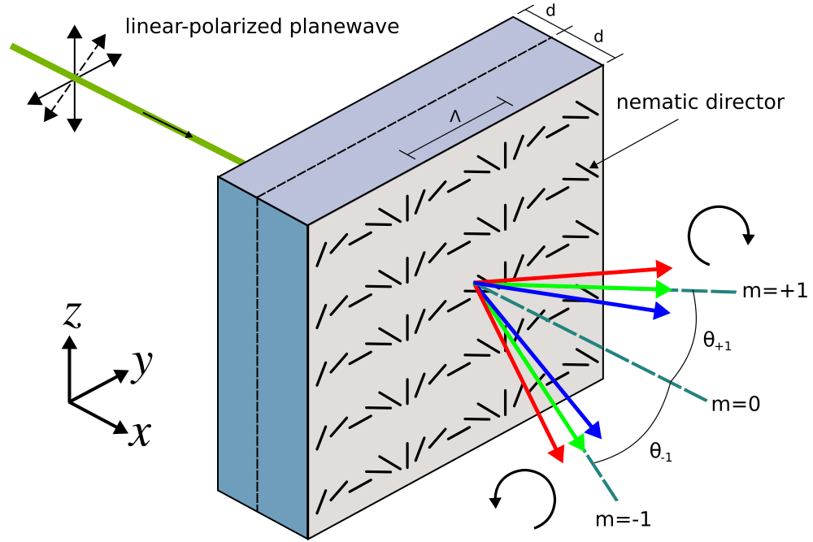
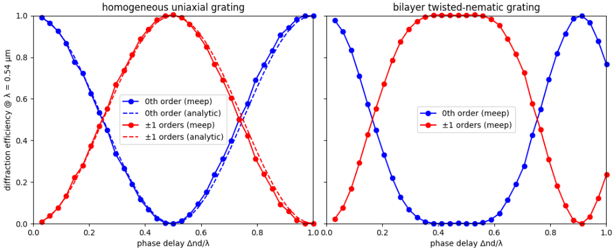
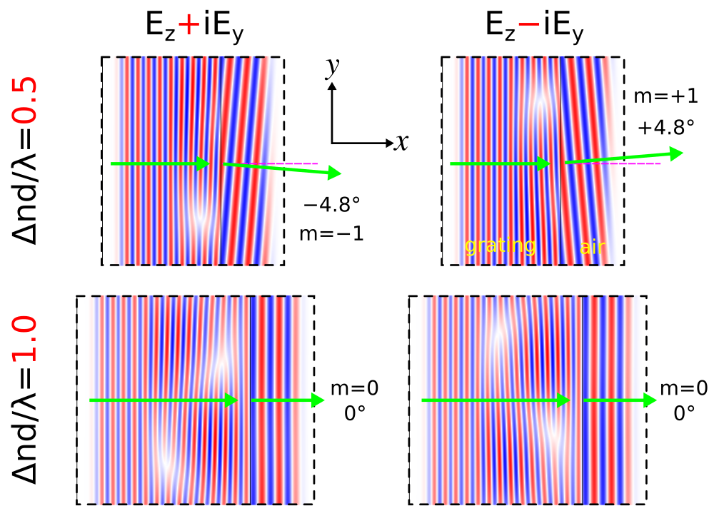

---
# Mode Decomposition
---

This tutorial demonstrates the [mode-decomposition](../Mode_Decomposition.md) feature which is used to decompose a given mode profile via the Fourier-transformed fields into a superposition of harmonic basis modes. Examples are provided for two kinds of modes in lossless, dielectric media: (1) localized (i.e., guided) and (2) non-localized (i.e., radiative planewave).

[TOC]

Reflectance of a Waveguide Taper
--------------------------------

This example involves computing the reflectance of the fundamental mode of a linear waveguide taper. The structure and the simulation parameters are shown in the schematic below. We will verify that computing the reflectance, the fraction of the incident power which is reflected, using two different methods produces nearly identical results: (1) mode decomposition and (2) [Poynting flux](../Introduction.md#transmittancereflectance-spectra). Also, we will demonstrate that the scaling of the reflectance with the taper length is quadratic, consistent with analytical results from [Optics Express, Vol. 16, pp. 11376-92, 2008](http://www.opticsinfobase.org/abstract.cfm?URI=oe-16-15-11376).

<center>

</center>

The structure, which can be viewed as a [two-port network](https://en.wikipedia.org/wiki/Two-port_network), consists of a single-mode waveguide of width 1 μm (`w1`) at a wavelength of 6.67 μm and coupled to a second waveguide of width 2 μm (`w2`) via a linearly-sloped taper of variable length `Lt`. The material is silicon with ε=12. The taper geometry is defined using a single [`prism`](../Scheme_User_Interface.md#prism) object with eight vertices. PML absorbing boundaries surround the entire cell. An eigenmode current source with E<sub>z</sub> polarization is used to launch the fundamental mode. The dispersion relation (or "band diagram") of the single-mode waveguide is shown in [Tutorial/Eigenmode Source](Eigenmode_Source.md). There is an eigenmode-expansion monitor placed at the midpoint of the first waveguide. This is a line monitor which extends beyond the waveguide in order to span the entire mode profile including its evanescent tails. The Fourier-transformed fields along this line monitor are used to compute the basis coefficients of the harmonic modes. These are computed separately via the eigenmode solver [MPB](https://mpb.readthedocs.io/en/latest/). This is described in [Mode Decomposition](../Mode_Decomposition.md) where it is also shown that the squared magnitude of the mode coefficient is equivalent to the power (Poynting flux) in the given eigenmode. The ratio of the complex mode coefficients can be used to compute the [S parameters](https://en.wikipedia.org/wiki/Scattering_parameters). In this example, we are computing |S<sub>11</sub>|<sup>2</sup> which is the reflectance (shown in the lines prefixed by "refl:,"). Another line monitor could have been placed in the second waveguide to compute the transmittance or |S<sub>21</sub>|<sup>2</sup> into the various guided modes (since the second waveguide is multi mode). The scattered power into the radiative modes can then be computed as 1-|S<sub>11</sub>|<sup>2</sup>-|S<sub>21</sub>|<sup>2</sup>. As usual, a normalization run is required involving a straight waveguide to compute the power in the source.

The structure has mirror symmetry in the $y$ direction which can be exploited to reduce the computation size by a factor of two. This requires that we use `add-flux` rather than `add-mode-monitor` (which is not optimized for symmetry) and specify the `eig-parity` keyword argument as `ODD-Z+EVEN-Y` in the call to `get-eigenmode-coefficients`.

The simulation script is in [examples/mode-decomposition.ctl](https://github.com/NanoComp/meep/blob/master/scheme/examples/mode-decomposition.ctl).

```scm
(set-param! resolution 61)  ; pixels/μm

(define-param w1 1.0)       ; width of waveguide 1
(define-param w2 2.0)       ; width of waveguide 2
(define-param Lw 10.0)      ; length of waveguides 1 and 2
(define-param Lt 8.0)       ; length of waveguide taper

(define-param dair 3.0)     ; length of air region
(define-param dpml-x 6.0)   ; length of PML in x direction
(define-param dpml-y 2.0)   ; length of PML in y direction

(define sx (+ dpml-x Lw Lt Lw dpml-x))
(define sy (+ dpml-y dair w2 dair dpml-y))

(define cell (make lattice (size sx sy no-size)))
(set! geometry-lattice cell)

(define Si (make medium (epsilon 12.0)))

(define boundary-layers (list (make pml (direction X) (thickness dpml-x))
                              (make pml (direction Y) (thickness dpml-y))))
(set! pml-layers boundary-layers)

(define-param lcen 6.67)  ; mode wavelength
(define fcen (/ lcen))    ; mode frequency

(define eig-src (list (make eigenmode-source
                        (src (make gaussian-src (frequency fcen) (fwidth (* 0.2 fcen))))
                        (center (vector3 (+ (* -0.5 sx) dpml-x (* 0.2 Lw)) 0 0))
                        (size 0 (- sy (* 2 dpml-y)) 0)
                        (eig-band 1)
                        (eig-match-freq? true)
                        (eig-parity (+ ODD-Z EVEN-Y)))))
(set! sources eig-src)

; straight waveguide
(define sw-vertices (list (vector3 (- (* -0.5 sx) 1) (* 0.5 w1) 0)
                          (vector3 (+ (* 0.5 sx) 1) (* 0.5 w1) 0)
                          (vector3 (+ (* 0.5 sx) 1) (* -0.5 w1) 0)
                          (vector3 (- (* -0.5 sx) 1) (* -0.5 w1) 0)))

(set! geometry (list (make prism
                       (vertices sw-vertices)
                       (axis 0 0 1)
                       (center auto-center)
                       (height infinity)
                       (material Si))))

(define symm (list (make mirror-sym (direction Y))))
(set! symmetries symm)

(define mon-pt (vector3 (+ (* -0.5 sx) dpml-x (* 0.7 Lw)) 0 0))
(define flux1 (add-flux fcen 0 1 (make flux-region (center mon-pt) (size 0 (- sy (* 2 dpml-y)) 0))))

(run-sources+ (stop-when-fields-decayed 50 Ez mon-pt 1e-9))

(save-flux "flux" flux1)
(define res1 (get-eigenmode-coefficients flux1 (list 1) #:eig-parity (+ ODD-Z EVEN-Y)))
(define incident-coeffs (array-ref (list-ref res1 0) 0 0 0))
(define incident-flux (list-ref (get-fluxes flux1) 0))

(reset-meep)

(set! geometry-lattice cell)

(set! pml-layers boundary-layers)

(set! sources eig-src)

; linear taper
(define tp-vertices (list (vector3 (- (* -0.5 sx) 1) (* 0.5 w1) 0)
                          (vector3 (* -0.5 Lt) (* 0.5 w1) 0)
                          (vector3 (* 0.5 Lt) (* 0.5 w2) 0)
                          (vector3 (+ (* 0.5 sx) 1) (* 0.5 w2) 0)
                          (vector3 (+ (* 0.5 sx) 1) (* -0.5 w2) 0)
                          (vector3 (* 0.5 Lt) (* -0.5 w2) 0)
                          (vector3 (* -0.5 Lt) (* -0.5 w1) 0)
                          (vector3 (- (* -0.5 sx) 1) (* -0.5 w1) 0)))

(set! geometry (list (make prism
                       (vertices tp-vertices)
                       (axis 0 0 1)
                       (center auto-center)
                       (height infinity)
                       (material Si))))

(set! symmetries symm)

(define flux2 (add-flux fcen 0 1 (make flux-region (center mon-pt) (size 0 (- sy (* 2 dpml-y)) 0))))
(load-minus-flux "flux" flux2)

(run-sources+ (stop-when-fields-decayed 50 Ez mon-pt 1e-9))

(define res2 (get-eigenmode-coefficients flux2 (list 1) #:eig-parity (+ ODD-Z EVEN-Y)))
(define taper-coeffs (array-ref (list-ref res2 0) 0 0 1))
(define taper-flux (list-ref (get-fluxes flux2) 0))

(print "refl:, " Lt ", " (/ (sqr (magnitude taper-coeffs)) (sqr (magnitude incident-coeffs))) ", " (/ (- taper-flux) incident-flux) "\n")
```

We compute the reflectance for five different taper lengths: 1, 2, 4, 8, and 16 μm. The Bash commands to run the simulation and extract the reflectance results from the output are:

```
for m in `seq 0 4`; do
    mpirun -np 2 meep Lt=$((2**${m})) mode-decomposition.ctl |tee -a waveguide_taper.out;
done

grep refl: waveguide_taper.out |cut -d, -f2- > waveguide_taper.dat
```

The results are plotted using the Octave/Matlab script below. The plot is shown in the accompanying figure.

```matlab
f = load('waveguide_taper.dat');
loglog(f(:,1),f(:,2),'bo-',f(:,1),f(:,3),'ro-',f(:,1),0.005./f(:,1).^2,'k-');
xlabel("taper length Lt (um)");
ylabel("reflectance");
legend("mode decomposition","Poynting flux","quadratic reference (1/Lt^2)");
axis([0.9 20 1e-6 1e-2]);
```

<center>

</center>

The reflectance values computed using the two methods are nearly identical. For reference, a line with quadratic scaling is shown in black. The reflectance of the linear waveguide taper decreases quadratically with the taper length which is consistent with the analytic theory.

Diffraction Spectrum of a Binary Grating
----------------------------------------

The mode-decomposition feature can also be applied to planewaves in homogeneous media with scalar permittivity/permeability (i.e., no anisotropy). This will be demonstrated in this example to compute the diffraction spectrum of a binary phase [grating](https://en.wikipedia.org/wiki/Diffraction_grating). The unit cell geometry of the grating is shown in the schematic below. The grating is periodic in the $y$ direction with periodicity `gp` and has a rectangular profile of height `gh` and duty cycle `gdc`. The grating parameters are `gh`=0.5 μm, `gdc`=0.5, and `gp`=10 μm. There is a semi-infinite substrate of thickness `dsub` adjacent to the grating. The substrate and grating are glass with a refractive index of 1.5. The surrounding is air/vacuum. Perfectly matched layers (PML) of thickness `dpml` are used in the $\pm x$ boundaries.

### Transmittance Spectra for Planewave at Normal Incidence

A pulsed planewave with E<sub>z</sub> polarization spanning wavelengths of 0.4 to 0.6 μm is normally incident on the grating from the glass substrate. The eigenmode monitor is placed in the air region. We will use mode decomposition to compute the transmittance &mdash; the ratio of the power in the $+x$ direction of the diffracted mode relative to that of the incident planewave &mdash; for the first ten diffraction orders. Two simulations are required: (1) an *empty* cell of homogeneous glass to obtain the incident power of the source, and (2) the grating structure to obtain the diffraction orders. At the end of the simulation, the wavelength, angle, and transmittance for each diffraction order are computed.

The simulation script is in [examples/binary_grating.ctl](https://github.com/NanoComp/meep/blob/master/scheme/examples/binary_grating.ctl).

<center>

</center>

```scm
(set-param! resolution 60)  ; pixels/μm

(define-param dpml 1.0)     ; PML thickness
(define-param dsub 3.0)     ; substrate thickness
(define-param dpad 3.0)     ; padding between grating and PML
(define-param gp 10.0)      ; grating period
(define-param gh 0.5)       ; grating height
(define-param gdc 0.5)      ; grating duty cycle

(define sx (+ dpml dsub gh dpad dpml))
(define sy gp)

(define cell (make lattice (size sx sy no-size)))
(set! geometry-lattice cell)

(define boundary-layers (list (make pml (thickness dpml) (direction X))))
(set! pml-layers boundary-layers)

(define-param wvl-min 0.4)          ; min wavelength
(define-param wvl-max 0.6)          ; max wavelength
(define fmin (/ wvl-max))           ; min frequency
(define fmax (/ wvl-min))           ; max frequency
(define fcen (* 0.5 (+ fmin fmax))) ; pulse frequency center
(define df (- fmax fmin))           ; pulse frequency width

(define pulse-src (list (make source
                          (src (make gaussian-src (frequency fcen) (fwidth df)))
                          (component Ez)
                          (center (+ (* -0.5 sx) dpml (* 0.5 dsub)) 0 0)
                          (size 0 sy 0))))

(set! sources pulse-src)

(set! k-point (vector3 0 0 0))

(define glass (make medium (index 1.5)))
(set! default-material glass)

(define symm (list (make mirror-sym (direction Y))))
(set! symmetries symm)

(define-param nfreq 21)
(define mon-pt (vector3 (- (* 0.5 sx) dpml (* 0.5 dpad)) 0 0))
(define flux-mon (add-flux fcen df nfreq (make flux-region (center mon-pt) (size 0 sy 0))))

(run-sources+ (stop-when-fields-decayed 50 Ez mon-pt 1e-9))

(define input-flux (get-fluxes flux-mon))
(define freqs (get-flux-freqs flux-mon))

(reset-meep)

(set! geometry-lattice cell)

(set! pml-layers boundary-layers)

(set! sources pulse-src)

(set! k-point (vector3 0 0 0))

(set! default-material air)

(set! geometry (list (make block
                       (material glass)
                       (size (+ dpml dsub) infinity infinity)
                       (center (+ (* -0.5 sx) (* 0.5 (+ dpml dsub))) 0 0))
                     (make block
                       (material glass)
                       (size gh (* gdc gp) infinity)
                       (center (+ (* -0.5 sx) dpml dsub (* 0.5 gh)) 0 0))))

(set! symmetries symm)

(define mode-mon (add-flux fcen df nfreq (make flux-region (center mon-pt) (size 0 sy 0))))

(run-sources+ (stop-when-fields-decayed 50 Ez mon-pt 1e-9))

(define-param nmode 10)
(define res (get-eigenmode-coefficients mode-mon (arith-sequence 1 1 nmode) #:eig-parity (+ ODD-Z EVEN-Y)))
(define coeffs (list-ref res 0))
(define kdom (list-ref res 3))

(map (lambda (nm)
       (map (lambda (nf)
              (let ((mode-wvl (/ (list-ref freqs nf)))
                    (mode-angle (rad->deg (acos (/ (vector3-x (list-ref kdom (+ (* nm nfreq) nf))) (list-ref freqs nf)))))
                    (mode-tran (/ (sqr (magnitude (array-ref coeffs nm nf 0))) (list-ref input-flux nf))))
                (if (> nm 0) (set! mode-tran (* 0.5 mode-tran)))
                (print "grating" (number->string nm) ":, " (number->string mode-wvl) ", " (number->string mode-angle) ", " (number->string mode-tran) "\n")))
              (arith-sequence 0 1 nfreq)))
     (arith-sequence 0 1 nmode))
```

Note the use of the keyword parameter argument `#eig-parity (+ ODD-Z EVEN-Y)` in the call to `get-eigenmode-coefficients`. This is important for specifying **non-degenerate** modes in MPB since the `k-point` is (0,0,0). `ODD-Z` is for modes with E<sub>z</sub> polarization. `EVEN-Y` is necessary since each diffraction order which is based on a given k<sub>x</sub> consists of *two* modes: one going in the +y direction and the other in the -y direction. `EVEN-Y` forces MPB to compute only the +k<sub>y</sub> + -k<sub>y</sub> (cosine) mode. As a result, the total transmittance must be halved in this case to obtain the transmittance for the individual +k<sub>y</sub> or -k<sub>y</sub> mode. For `ODD-Y`, MPB will compute the +k<sub>y</sub> - -k<sub>y</sub> (sine) mode but this will have zero power because the source is even. If the $y$ parity is left out, MPB will return a random superposition of the cosine and sine modes. Alternatively, in this example an input planewave with H<sub>z</sub> instead of E<sub>z</sub> polarization can be used which requires `#eig_parity (+ EVEN-Z ODD-Y)` as well as an odd mirror symmetry plane in *y*. Finally, note the use of `add-flux` instead of `add-mode-monitor` when using symmetries.

The script is run and the output is piped to a file. The results for the diffraction orders, which are displayed in the lines prefixed by `grating`, are extracted from the output and placed into a separate file using the following commands:

```
mpirun -np 2 meep binary_grating.ctl |tee diffraction_spectra.out;
grep grating diffraction_spectra.out |cut -d, -f2- > diffraction_spectra.dat;
```

The diffraction spectrum is then plotted using the following Octave/Matlab script and shown in the figure below.

```matlab
f = dlmread('diffraction_spectrum.dat');
nfreq = 21;
nmode = 10;
wvl = reshape(f(:,1),nfreq,nmode);
ang = reshape(f(:,2),nfreq,nmode);
tran = reshape(f(:,3),nfreq,nmode);

pcolor(wvl,ang,tran);
shading flat;
c = colormap("ocean");
colormap(flipud(c));
colorbar;
caxis([0 0.4]);

xlabel("wavelength (um)");
ylabel("diffraction angle (degrees)");
title("transmittance of diffraction orders");

axis([0.4 0.6 0 30]);
set(gca, 'xtick', [0.4:0.1:0.6]);
set(gca, 'ytick', [0:5:30]);
```

Each diffraction order corresponds to a single angle. In the figure below, this angle is represented by the *lower* boundary of each labeled region. For example, the m=0 order has a diffraction angle of 0° at all wavelengths. The representation of the diffraction orders as finite angular regions is an artifact of Octave/Matlab's [pcolor](https://octave.sourceforge.io/octave/function/pcolor.html) routine. Note that only the positive diffraction orders are shown as these are equivalent to the negative orders due to the symmetry of the source and the structure. The transmittance of each diffraction order should ideally be a constant for all wavelengths. The slight wavelength dependence shown in the figure is due to numerical discretization which can be mitigated by increasing the resolution.

The diffraction orders/modes are a finite set of propagating planewaves. The wavevector k<sub>x</sub> of these modes can be computed analytically: for a frequency of ω (in c=1 units), these propagating modes are the **real** solutions of sqrt(ω²n²-(k<sub>y</sub>+2πm/Λ)²) where m is the diffraction order (an integer), Λ is the periodicity of the grating, and n is the refractive index of the propagating medium. In this example, n=1, k<sub>y</sub>=0, and Λ=10 μm. Thus, at a wavelength of 0.5 μm there are a total of 20 diffraction orders of which we only computed the first 10. The wavevector k<sub>x</sub> is used to compute the angle of the diffraction order as cos<sup>-1</sup>(k<sub>x</sub>/(ωn)). Evanescent modes, those with an imaginary k<sub>x</sub>, exist for |m|>20 but these modes carry no power. Note that currently Meep does not compute the number of propagating modes for you. If the mode number passed to `get-eigenmode-coefficients` is larger than the number of propagating modes at a given frequency/wavelength, MPB's Newton solver will fail to converge and will return zero for the mode coefficient. It is therefore a good idea to know beforehand the number of propagating modes.

<center>

</center>

In the limit where the grating periodicity is much larger than the wavelength and the size of the diffracting element (i.e., more than 10 times), as it is in this example, the [diffraction efficiency](https://en.wikipedia.org/wiki/Diffraction_efficiency) can be computed analytically using scalar theory. This is described in the OpenCourseWare [Optics course](https://ocw.mit.edu/courses/mechanical-engineering/2-71-optics-spring-2009/) in the Lecture 16 (Gratings: Amplitude and Phase, Sinusoidal and Binary) [notes](https://ocw.mit.edu/courses/mechanical-engineering/2-71-optics-spring-2009/video-lectures/lecture-16-gratings-amplitude-and-phase-sinusoidal-and-binary/MIT2_71S09_lec16.pdf) and [video](https://www.youtube.com/watch?v=JmWguqCZRxk). For a review of scalar diffraction theory, see Chapter 3 ("Analysis of Two-Dimensional Signals and Systems") of [Introduction to Fourier Optics (fourth edition)](https://www.amazon.com/Introduction-Fourier-Optics-Joseph-Goodman-ebook/dp/B076TBP48F) by J.W. Goodman. From the scalar theory, the diffraction efficiency of the binary grating is 4/(mπ)<sup>2</sup> when the phase difference between the propagating distance in the glass relative to the same distance in air is π. The phase difference/contrast is (2π/λ)(n-1)s where λ is the wavelength, n is the refractive index of the grating, and s is the propagation distance in the grating (`gh` in the script). A special feature of the binary grating is that the diffraction efficiency is 0 for all *even* orders. This is verified by the diffraction spectrum shown above.

To convert the diffraction efficiency into transmittance in the *x* direction (in order to be able to compare the scalar-theory results with those from Meep), the diffraction efficiency must be multiplied by the Fresnel transmittance from air to glass and by the cosine of the diffraction angle. We compare the analytic and simulated results at a wavelength of 0.5 μm for diffraction orders 1 (2.9°), 3 (8.6°), 5 (14.5°), and 7 (20.5°). The analytic results are 0.3886, 0.0427, 0.0151, and 0.0074. The Meep results are 0.3891, 0.04287, 0.0152, and 0.0076. This corresponds to relative errors of approximately 1.3%, 0.4%, 0.8%, and 2.1% which indicates good agreement.

### Reflectance and Transmittance Spectra for Planewave at Oblique Incidence

As an additional demonstration of the mode-decomposition feature, the reflectance and transmittance of all diffracted orders for any grating with no material absorption and a planewave source incident at any arbitrary angle and wavelength must necessarily sum to unity. Also, the total reflectance and transmittance must be equivalent to values computed using the Poynting flux. This demonstration is somewhat similar to the [single-mode waveguide example](#reflectance-of-a-waveguide-taper).

The following script is adapted from the previous binary-grating example involving a [normally-incident planewave](#transmittance-spectra-for-planewave-at-normal-incidence). The total reflectance, transmittance, and their sum are displayed at the end of the simulation on two separate lines prefixed by `mode-coeff:` and `poynting-flux:`.

Results are computed for a single wavelength of 0.5 μm. The pulsed planewave is incident at an angle of 10.7°. Its spatial profile is defined using the source amplitude function `pw-amp`. This [anonymous function](https://en.wikipedia.org/wiki/Anonymous_function) takes two arguments, the wavevector and a point in space (both `vector3`s), and returns a function of one argument which defines the planewave amplitude at that point. A narrow bandwidth pulse is used in order to mitigate the intrinsic discretization effects of the [Yee grid](../Yee_Lattice.md) for oblique planewaves. Also, the `stop-when-fields-decayed` termination criteria is replaced with a fixed run time `run-sources+ 100`, etc. As a general rule of thumb, the more oblique the planewave source, the longer the run time required to ensure accurate results. There is an additional line monitor between the source and the grating for computing the reflectance. The angle of each reflected/transmitted mode, which can be positive or negative, is computed using its dominant planewave vector. Since the oblique source breaks the symmetry in the $y$ direction, each diffracted order must be computed separately. In total, there are 59 reflected and 39 transmitted orders.

The simulation script is in [examples/binary_grating_oblique.ctl](https://github.com/NanoComp/meep/blob/master/scheme/examples/binary_grating_oblique.ctl).

```scm
(set-param! resolution 50)  ; pixels/μm

(define-param dpml 1.0)     ; PML thickness
(define-param dsub 3.0)     ; substrate thickness
(define-param dpad 3.0)     ; padding between grating and PML
(define-param gp 10.0)      ; grating period
(define-param gh 0.5)       ; grating height
(define-param gdc 0.5)      ; grating duty cycle

(define sx (+ dpml dsub gh dpad dpml))
(define sy gp)

(define cell (make lattice (size sx sy no-size)))
(set! geometry-lattice cell)

(define boundary-layers (list (make pml (thickness dpml) (direction X))))
(set! pml-layers boundary-layers)

(define-param wvl-cen 0.5)  ; center wavelength
(define fcen (/ wvl-cen))   ; center frequency
(define df (* 0.05 fcen))   ; frequency width

(define ng 1.5)
(define glass (make medium (index ng)))
(set! default-material glass)

(define-param use-cw-solver? false)       ; CW solver or time stepping?
(define-param cw-solver-tol 1e-6)         ; CW solver tolerance
(define-param cw-solver-max-iters 2000)   ; CW solver max iterations
(define-param cw-solver-L 10)             ; CW solver L

; rotation angle of incident planewave; counter clockwise (CCW) about Z axis, 0 degrees along +X axis
(define-param theta-in 10.7)
(set! theta-in (deg->rad theta-in))

; k (in source medium) with correct length (plane of incidence: XY)
(define k (rotate-vector3 (vector3 0 0 1) theta-in (vector3 (* fcen ng) 0 0)))

(define symm '())
(define eig-parity ODD-Z)
(if (= theta-in 0)
    (begin
      (set! k (vector3 0 0 0))
      (set! symm (list (make mirror-sym (direction Y))))
      (set! eig-parity (+ eig-parity EVEN-Y))))

(set! k-point k)

(set! symmetries symm)

(define (pw-amp k x0)
  (lambda (x)
    (exp (* 0+1i 2 pi (vector3-dot k (vector3- x x0))))))

(define src-pt (vector3 (+ (* -0.5 sx) dpml (* 0.3 dsub)) 0 0))
(define pw-src (list (make source
                       (if use-cw-solver?
                           (src (make continuous-src (frequency fcen) (fwidth df)))
                           (src (make gaussian-src (frequency fcen) (fwidth df))))
                       (component Ez)
                       (center src-pt)
                       (size 0 sy 0)
                       (amp-func (pw-amp k src-pt)))))

(set! sources pw-src)

(define refl-pt (vector3 (+ (* -0.5 sx) dpml (* 0.5 dsub)) 0 0))
(define refl-flux1 (add-flux fcen 0 1 (make flux-region (center refl-pt) (size 0 sy 0))))

(if use-cw-solver?
    (begin
      (init-fields)
      (meep-fields-solve-cw fields cw-solver-tol cw-solver-maxiters cw-solver-L))
    (run-sources+ 100))

(save-flux "flux" refl-flux1)
(define input-flux (get-fluxes refl-flux1))
(define freqs (get-flux-freqs refl-flux1))

(reset-meep)

(set! geometry-lattice cell)

(set! pml-layers boundary-layers)

(set! sources pw-src)

(set! k-point k)

(set! symmetries symm)

(set! default-material air)

(set! geometry (list (make block
                       (material glass)
                       (size (+ dpml dsub) infinity infinity)
                       (center (+ (* -0.5 sx) (* 0.5 (+ dpml dsub))) 0 0))
                     (make block
                       (material glass)
                       (size gh (* gdc gp) infinity)
                       (center (+ (* -0.5 sx) dpml dsub (* 0.5 gh)) 0 0))))

(define refl-flux2 (add-flux fcen 0 1 (make flux-region (center refl-pt) (size 0 sy 0))))
(load-minus-flux "flux" refl-flux2)

(define tran-pt (vector3 (- (* 0.5 sx) dpml (* 0.5 dpad)) 0 0))
(define tran-flux (add-flux fcen 0 1 (make flux-region (center tran-pt) (size 0 sy 0))))

(if use-cw-solver?
    (begin
      (init-fields)
      (meep-fields-solve-cw fields cw-solver-tol cw-solver-maxiters cw-solver-L))
    (run-sources+ 200))

; number of reflected orders
(define nm-r (- (floor (* (- (* fcen ng) (vector3-y k)) gp)) (ceiling (* (- (- (* fcen ng)) (vector3-y k)) gp))))
(if (= theta-in 0) (set! nm-r (* 0.5 nm-r)))

(define res1 (get-eigenmode-coefficients refl-flux2 (arith-sequence 1 1 nm-r) #:eig-parity eig-parity))
(define r-coeffs (list-ref res1 0))
(define kdom1 (list-ref res1 3))

(define Rsum 0)
(define r-angle 0)
(map (lambda (nm)
       (let ((r-kdom (list-ref kdom1 nm))
             (Rmode (/ (sqr (magnitude (array-ref r-coeffs nm 0 1))) (list-ref input-flux 0))))
         (set! r-angle (* (if (positive? (vector3-y r-kdom)) +1 -1) (acos (/ (vector3-x r-kdom) (* ng fcen)))))
         (print "refl:, " nm ", " (rad->deg r-angle) ", " Rmode "\n")
         (set! Rsum (+ Rsum Rmode))))
     (arith-sequence 0 1 (- nm-r 1)))

; number of transmitted orders
(define nm-t (- (floor (* (- fcen (vector3-y k)) gp)) (ceiling (* (- (- fcen) (vector3-y k)) gp))))
(if (= theta-in 0) (set! nm-t (* 0.5 nm-t)))

(define res2 (get-eigenmode-coefficients tran-flux (arith-sequence 1 1 nm-t) #:eig-parity eig-parity))
(define t-coeffs (list-ref res2 0))
(define kdom2 (list-ref res2 3))

(define Tsum 0)
(define t-angle 0)
(map (lambda (nm)
       (let ((t-kdom (list-ref kdom2 nm))
             (Tmode (/ (sqr (magnitude (array-ref t-coeffs nm 0 0))) (list-ref input-flux 0))))
         (set! t-angle (* (if (positive? (vector3-y t-kdom)) +1 -1) (acos (/ (vector3-x t-kdom) fcen))))
         (print "tran:, " nm ", " (rad->deg t-angle) ", " Tmode "\n")
         (set! Tsum (+ Tsum Tmode))))
     (arith-sequence 0 1 (- nm-t 1)))

(print "mode-coeff:, " Rsum ", " Tsum ", " (+ Rsum Tsum) "\n")

(define r-flux (get-fluxes refl-flux2))
(define t-flux (get-fluxes tran-flux))

(define Rflux (/ (- (list-ref r-flux 0)) (list-ref input-flux 0)))
(define Tflux (/ (list-ref t-flux 0) (list-ref input-flux 0)))

(print "poynting-flux:, "  Rflux ", " Tflux ", " (+ Rflux Tflux) "\n")
```

Since this is a single-wavelength calculation, the [frequency-domain solver](../Scheme_User_Interface.md#frequency-domain-solver) can be used instead of time stepping for a possible performance enhancement. The only changes necessary to the original script are to replace two objects: (1) `gaussian-src` with `continuous-src` and (2) `run-sources+` with `solve-cw`. Choosing which approach to use is determined by the `use-cw-solver?` boolean variable. In this example, mainly because of the oblique source, the frequency-domain solver converges slowly and is less efficient than the time-stepping simulation. The results from both approaches are nearly identical. Time stepping is therefore the default.

The following are several lines of output for eight of the reflected and transmitted orders. The first numerical column is the mode number, the second is the mode angle (in degrees), and the third is the fraction of the input power that is concentrated in the mode. Note that the thirteenth transmitted order at 19.18° contains nearly 38% of the input power.

```
...
refl:, 7, 6.834390306759177, 6.646699980461214e-5
refl:, 8, -8.491733572126286, 5.6932380402278446e-5
refl:, 9, 8.762167961399326, 1.574826136447098e-4
refl:, 10, -10.428015375771137, 1.2703982628727411e-5
refl:, 11, 10.700000001269709, 0.04414670765876341
refl:, 12, -12.376421394445115, 5.968970605590464e-5
refl:, 13, 12.650301971909244, 4.153476164523912e-4
refl:, 14, -14.339483455998984, 1.9840412629779723e-5
...
```

```
...
tran:, 12, -18.753667459322305, 9.553822309008259e-4
tran:, 13, 19.177752198909452, 0.38260778171916043
tran:, 14, -21.80816069361731, 0.0019851617272472295
tran:, 15, 22.240795352546787, 0.0010720512535881022
tran:, 16, -24.929329893447417, 9.840901627875952e-4
tran:, 17, 25.372399103290473, 0.04148386622718453
tran:, 18, -28.13171390642741, 0.001373410746156767
tran:, 19, 28.587475380921063, 0.0011387843637119684
...
```

The mode number is equivalent to the band index from the MPB calculation. The ordering of the modes is according to *decreasing* values of k<sub>x</sub>. The first mode has the largest k<sub>x</sub> and thus angle closest to 0°. As a corollary, the first mode has the smallest |k<sub>y</sub>+2πm/Λ|. For a non-zero k<sub>y</sub> (as in the case of an obliquely incident source), this expression will not necessarily be zero. The first seven reflected modes have m values of -3, -4, -2, -5, -1, -6, and 0. These m values are not monotonic. This is because k<sub>x</sub> is a nonlinear function of m as shown earlier. The ordering of the transmitted modes is different since these modes are in vacuum and not glass (recall that the medium's refractive index is also a part of this nonlinear function). In the first example involving a normally incident source with k<sub>y</sub>=0, the ordering of the modes is monotonic: m = 0, &#177;1, &#177;2, ...

The two main lines of the output are:

```
mode-coeff:, 0.061033606092644827, 0.9376401684473735, 0.9986737745400184
poynting-flux:, 0.061102475360487296, 0.938344211286383, 0.9994466866468703
```

The first numerical column is the total reflectance, the second is the total transmittance, and the third is their sum. Results from the mode coefficients agree with the Poynting flux values to three decimal places. Also, the total reflectance and transmittance sum to unity. These results indicate that approximately 6% of the input power is reflected and the remaining 94% is transmitted.

Phase Map of a Subwavelength Binary Grating
-------------------------------------------

We can also use the complex mode coefficients to compute the phase (or impedance) of the diffraction orders. This can be used to generate a phase map of the binary grating as a function of its geometric parameters. Phase maps are important for the design of subwavelength phase shifters such as those used in a metasurface lens. When the period of the unit cell is subwavelength, the zeroth-diffraction order is the only propagating wave. In this demonstration, which is adapted from the previous example, we compute the transmittance spectra and phase map of the zeroth-diffraction order (at 0°) for an E<sub>z</sub>-polarized planewave pulse spanning wavelengths of 0.4 to 0.6 μm which is normally incident on a binary grating with a periodicity of 0.35 μm and height of 0.6 μm. The duty cycle of the grating is varied from 0.1 to 0.9 in separate runs.

The simulation script is in [examples/binary_grating_phasemap.ctl](https://github.com/NanoComp/meep/blob/master/scheme/examples/binary_grating_phasemap.ctl).

```scm
(set-param! resolution 60)  ; pixels/μm

(define-param dpml 1.0)     ; PML thickness
(define-param dsub 3.0)     ; substrate thickness
(define-param dpad 3.0)     ; padding between grating and PML
(define-param gp 0.35)      ; grating period
(define-param gh 0.6)       ; grating height
(define-param gdc 0.5)      ; grating duty cycle

(define sx (+ dpml dsub gh dpad dpml))
(define sy gp)

(define cell (make lattice (size sx sy no-size)))
(set! geometry-lattice cell)

(define boundary-layers (list (make pml (thickness dpml) (direction X))))
(set! pml-layers boundary-layers)

(define-param wvl-min 0.4)          ; min wavelength
(define-param wvl-max 0.6)          ; max wavelength
(define fmin (/ wvl-max))           ; min frequency
(define fmax (/ wvl-min))           ; max frequency
(define fcen (* 0.5 (+ fmin fmax))) ; pulse frequency center
(define df (- fmax fmin))           ; pulse frequency width
(define-param nfreq 21)             ; number of frequency bins

(define-param odd-z? true)

(define pulse-src (list (make source
                          (src (make gaussian-src (frequency fcen) (fwidth df)))
                          (component (if odd-z? Ez Hz))
                          (center (+ (* -0.5 sx) dpml (* 0.5 dsub)) 0 0)
                          (size 0 sy 0))))

(set! sources pulse-src)

(set! k-point (vector3 0 0 0))

(define glass (make medium (index 1.5)))
(set! default-material glass)

(define symm (list (make mirror-sym (direction Y) (phase (if odd-z? +1 -1)))))
(set! symmetries symm)

(define mon-pt (vector3 (- (* 0.5 sx) dpml (* 0.5 dpad)) 0 0))
(define flux-mon (add-flux fcen df nfreq (make flux-region (center mon-pt) (size 0 sy 0))))

(run-sources+ 100)

(define input-flux (get-fluxes flux-mon))
(define freqs (get-flux-freqs flux-mon))

(reset-meep)

(set! geometry-lattice cell)

(set! pml-layers boundary-layers)

(set! sources pulse-src)

(set! k-point (vector3 0 0 0))

(set! default-material air)

(set! geometry (list (make block
                       (material glass)
                       (size (+ dpml dsub) infinity infinity)
                       (center (+ (* -0.5 sx) (* 0.5 (+ dpml dsub))) 0 0))
                     (make block
                       (material glass)
                       (size gh (* gdc gp) infinity)
                       (center (+ (* -0.5 sx) dpml dsub (* 0.5 gh)) 0 0))))

(set! symmetries symm)

(define mode-mon (add-flux fcen df nfreq (make flux-region (center mon-pt) (size 0 sy 0))))

(run-sources+ 300)

(define res (get-eigenmode-coefficients mode-mon (list 1) #:eig-parity (if odd-z? (+ ODD-Z EVEN-Y) (+ EVEN-Z ODD-Y))))
(define coeffs (list-ref res 0))

(map (lambda (nf)
       (let ((mode-wvl (/ (list-ref freqs nf)))
             (mode-tran (/ (sqr (magnitude (array-ref coeffs 0 nf 0))) (list-ref input-flux nf)))
             (mode-phase (angle (array-ref coeffs 0 nf 0))))
         (print "grating" (number->string nf) ":, " (number->string mode-wvl) ", " (number->string mode-tran) ", " (number->string mode-phase) "\n")))
     (arith-sequence 0 1 nfreq))
```

The phase of the zeroth-diffraction order is simply the angle of its complex mode coefficient. Note that it is generally only the relative phase (the phase difference) between different structures that is useful. The overall mode coefficient α is multiplied by a complex number given by the source amplitude, as well as an arbitrary (but deterministic) phase choice by the mode solver MPB — but as long as you keep the current source fixed as you vary the parameters of the structure, the relative phases are meaningful.

The script is run from the shell terminal using the following Bash commands:

```
for gdc in `seq 0.1 0.1 0.9`; do
    meep odd-z?=true gp=0.35 gh=0.6 gdc=${gdc} binary_grating_phasemap.ctl |tee -a phasemap.out;
done

grep grating phasemap.out |cut -d, -f2- > phasemap.dat;
```

The results are plotted using the Octave/Matlab script below. The plot is shown in the accompanying figure.

```matlab
f = dlmread('phasemap.dat');
nfreq = 21;
ngdc = 9;

gdc = ones(nfreq,1)*[0.1:0.1:0.9];

wvl = reshape(f(:,1),nfreq,ngdc);
tran = reshape(f(:,2),nfreq,ngdc);
ang = reshape(f(:,3),nfreq,ngdc);

h1 = subplot(1,2,1);
pcolor(wvl,gdc,tran);
c1 = colormap("hot");
colormap(h1,flipud(c1));
shading interp;
colorbar;
caxis([0 1.0]);

axis([0.4 0.6 0.1 0.9]);
set(gca, 'xtick', [0.4:0.1:0.6]);
set(gca, 'ytick', [0.1:0.1:0.9]);

xlabel("wavelength (um)");
ylabel("grating duty cycle");
title("transmittance");

h2 = subplot(1,2,2);
pcolor(wvl,gdc,ang);
c2 = colormap("jet");
colormap(h2, flipud(c2));
shading interp;
colorbar;

axis([0.4 0.6 0.1 0.9]);
set(gca, 'xtick', [0.4:0.1:0.6]);
set(gca, 'ytick', [0.1:0.1:0.9]);

xlabel("wavelength (um)");
ylabel("grating duty cycle");
title("phase (radians)");
```

The figure below shows the transmittance spectra (left) and phase map (right). The transmittance is nearly unity over most of the parameter space mainly because of the subwavlength dimensions of the grating. The phase variation spans the full range of -π to +π at each wavelength but varies weakly with the duty cycle due to the relatively low index of the glass grating. Higher-index materials such as [titanium dioxide](https://en.wikipedia.org/wiki/Titanium_dioxide#Thin_films) (TiO<sub>2</sub>) generally provide more control over the phase.

<center>

</center>

Diffraction Spectra of Liquid-Crystal Polarization Gratings
-----------------------------------------------------------

As a final demonstration of mode decomposition, we compute the diffraction spectrum of a [liquid-crystal](https://en.wikipedia.org/wiki/Liquid_crystal) polarization grating. These types of beam splitters use [birefringence](https://en.wikipedia.org/wiki/Birefringence) to produce diffraction orders which are [circularly polarized](https://en.wikipedia.org/wiki/Circular_polarization). We will investigate two kinds of polarization gratings: (1) a homogeneous [uniaxial](https://en.wikipedia.org/wiki/Birefringence#Uniaxial_materials) grating (commonly known as a circular-polarization grating), and (2) a [twisted-nematic](https://en.wikipedia.org/wiki/Liquid_crystal#Chiral_phases) bilayer grating as described in [Optics Letters, Vol. 33, No. 20, pp. 2287-9, 2008](https://www.osapublishing.org/ol/abstract.cfm?uri=ol-33-20-2287) ([pdf](https://www.imagineoptix.com/cms/wp-content/uploads/2017/01/OL_08_Oh-broadband_PG.pdf)). The homogeneous uniaxial grating is just a special case of the twisted-nematic grating with a nematic [director](https://en.wikipedia.org/wiki/Liquid_crystal#Director) rotation angle of φ=0°.

A schematic of the grating geometry is shown below. The grating is a 2d slab in the *xy*-plane with two parameters: birefringence (Δn) and thickness (d). The twisted-nematic grating consists of two layers of thickness d each with equal and opposite rotation angles of φ=70° for the nematic director. Both gratings contain only three diffraction orders: m=0, ±1. The m=0 order is linearly polarized and the m=±1 orders are circularly polarized with opposite chirality. For the uniaxial grating, the diffraction efficiencies for a mode with wavelength λ can be computed analytically: η<sub>0</sub>=cos<sup>2</sup>(πΔnd/λ), η<sub>±1</sub>=0.5sin<sup>2</sup>(πΔnd/λ). The derivation of these formulas is presented in [Optics Letters, Vol. 24, No. 9, pp. 584-6, 1999](https://www.osapublishing.org/ol/abstract.cfm?uri=ol-24-9-584). We will verify these analytic results and also demonstrate that the twisted-nematic grating produces a broader bandwidth response for the ±1 orders than the homogeneous uniaxial grating. An important property of these polarization gratings for e.g. display applications is that for a circular-polarized input planewave and phase delay (Δnd/λ) of nearly 0.5, there is only a single diffraction order (+1 or -1) with *opposite* chiraity to that of the input. This is also demonstrated below.

<center>

</center>

In this example, the input is a linear-polarized planewave pulse at normal incidence with center wavelength of λ=0.54 μm. The linear polarization is in the *yz*-plane with a rotation angle of 45° counter clockwise around the *x* axis. Two sets of mode coefficients are computed in the air region adjacent to the grating for each orthogonal polarization: `ODD-Z+EVEN-Y` and `EVEN-Z+ODD-Y`, which correspond to +k<sub>y</sub> + -k<sub>y</sub> (cosine) and +k<sub>y</sub> - -k<sub>y</sub> (sine) modes. From these coefficients for linear-polarized modes, the power in the circular-polarized modes can be computed: |ODD-Z+EVEN-Y|<sup>2</sup>+|EVEN-Z+ODD-Y|<sup>2</sup>. The power is identical for the two circular-polarized modes with opposite chiralities since the input is linearly polarized and at normal incidence. The transmittance for the diffraction orders are computed from the mode coefficients. As usual, this requires a separate normalization run to compute the power of the input planewave.

The anisotropic permittivity of the grating is specified using the [material function](../Scheme_User_Interface.md#material) `lc-mat` which involves a position-dependent rotation of the diagonal ε tensor about the *x* axis. For φ=0°, the nematic director is oriented along the *z* axis: E<sub>z</sub> has a larger permittivity than E<sub>y</sub> where the birefringence (Δn) is 0.159. The grating has a periodicity of Λ=6.5 μm in the *y* direction.

The simulation script is in [examples/polarization_grating.ctl](https://github.com/NanoComp/meep/blob/master/scheme/examples/polarization_grating.ctl).

```scm
(set-param! resolution 50)    ; pixels/μm

(define-param dpml 1.0)       ; PML thickness
(define-param dsub 1.0)       ; substrate thickness
(define-param dpad 1.0)       ; padding thickness

(set! k-point (vector3 0 0 0))

(define boundary-layers (list (make pml (thickness dpml) (direction X))))
(set! pml-layers boundary-layers)

(define n0 1.55)
(define delta-n 0.159)
(define eps-diag (matrix3x3 (vector3 (sqr n0) 0 0)
                            (vector3 0 (sqr n0) 0)
                            (vector3 0 0 (sqr (+ n0 delta-n)))))

(define-param wvl 0.54)      ; center wavelength
(define fcen (/ wvl))        ; center frequency

(define-param d 1.7)         ; chiral layer thickness
(define-param ph 70)         ; chiral layer twist angle
(define-param gp 6.5)        ; grating period
(define-param nmode 5)       ; number of mode coefficients to compute

(set! ph (deg->rad ph))

(define sx (+ dpml dsub d d dpad dpml))
(define sy gp)

(define cell (make lattice (size sx sy no-size)))
(set! geometry-lattice cell)

; linear-polarized planewave pulse source
(define src-pt (vector3 (+ (* -0.5 sx) dpml (* 0.3 dsub)) 0 0))
(define lp-src (list (make source
                       (src (make gaussian-src (frequency fcen) (fwidth (* 0.05 fcen))))
                       (component Ez)
                       (center src-pt)
                       (size 0 sy 0))
                     (make source
                       (src (make gaussian-src (frequency fcen) (fwidth (* 0.05 fcen))))
                       (component Ey)
                       (center src-pt)
                       (size 0 sy 0))))

(set! sources lp-src)

(set! default-material (make medium (index n0)))

(define tran-pt (vector3 (- (* 0.5 sx) dpml (* 0.5 dpad)) 0 0))
(define tran-flux1 (add-flux fcen 0 1 (make flux-region (center tran-pt) (size 0 sy 0))))

(run-sources+ 100)

(define input-flux (get-fluxes tran-flux1))

(reset-meep)

(set! geometry-lattice cell)

(set! pml-layers boundary-layers)

(set! sources lp-src)

(set! k-point (vector3 0 0 0))

(set! default-material air)

; twist angle of nematic director; from equation 1b
(define phi (lambda (p)
              (let ((xx (- (vector3-x p) (+ (* -0.5 sx) dpml dsub))))
                (if (and (>= xx 0) (<= xx d))
                    (+ (* pi (vector3-y p) (/ gp)) (* ph xx (/ d)))
                    (+ (* pi (vector3-y p) (/ gp)) (- (* ph xx (/ d))) (* 2 ph))))))

(define lc-epsilon-diag (vector3 0 0 0))
(define lc-epsilon-offdiag (vector3 0 0 0))
(define lc-epsilon (matrix3x3 (vector3 0 0 0) (vector3 0 0 0) (vector3 0 0 0)))

; return the anisotropic permittivity tensor for a uniaxial, twisted nematic liquid crystal
(define lc-mat (lambda (p)
                 (let
                     ; rotation matrix for rotation around x axis
                     ((Rx (matrix3x3 (vector3 1 0 0)
                                     (vector3 0 (cos (phi p)) (sin (phi p)))
                                     (vector3 0 (- (sin (phi p))) (cos (phi p))))))
                   (set! lc-epsilon (matrix3x3* Rx (matrix3x3* eps-diag (matrix3x3-transpose Rx))))
                   (set! lc-epsilon-diag (vector3 (vector3-x (vector3-x lc-epsilon))
                                                  (vector3-y (vector3-y lc-epsilon))
                                                  (vector3-z (vector3-z lc-epsilon))))
                   (set! lc-epsilon-offdiag (vector3 (vector3-x (vector3-y lc-epsilon))
                                                     (vector3-x (vector3-z lc-epsilon))
                                                     (vector3-y (vector3-z lc-epsilon))))
                   (make medium (epsilon-diag lc-epsilon-diag) (epsilon-offdiag lc-epsilon-offdiag)))))

(set! geometry (list
                (make block
                  (center (+ (* -0.5 sx) (* 0.5 (+ dpml dsub))) 0 0)
                  (size (+ dpml dsub) infinity infinity)
                  (material (make medium (index n0))))
                (make block
                  (center (+ (* -0.5 sx) dpml dsub d) 0 0)
                  (size (* 2 d) infinity infinity)
                  (material (make material-function (material-func lc-mat))))))

(define tran-flux2 (add-flux fcen 0 1 (make flux-region (center tran-pt) (size 0 sy 0))))

(run-sources+ 300)

(define res1 (get-eigenmode-coefficients tran-flux2 (arith-sequence 1 1 nmode) #:eig-parity (+ ODD-Z EVEN-Y)))
(define res2 (get-eigenmode-coefficients tran-flux2 (arith-sequence 1 1 nmode) #:eig-parity (+ EVEN-Z ODD-Y)))

(define t-coeffs1 (list-ref res1 0))
(define t-coeffs2 (list-ref res2 0))
(define kdom (list-ref res1 3))

(map (lambda (nm)
       (let ((mode-angle (acos (/ (vector3-x (list-ref kdom nm)) fcen)))
             (mode-tran (/ (+ (sqr (magnitude (array-ref t-coeffs1 nm 0 0))) (sqr (magnitude (array-ref t-coeffs2 nm 0 0)))) (list-ref input-flux 0))))
         (print "tran:, " nm ", " (rad->deg mode-angle) ", " mode-tran "\n")))
     (arith-sequence 0 1 nmode))
```

The Bash script below runs the grating simulations over a range of grating thicknesses from 0.1 to 3.4 μm corresponding to phase delays (Δnd/λ) of approximately 0 to 1. The entire output is saved to a file and the transmittance data is extracted from the output and placed in a separate file.

```sh
for d in `seq 0.1 0.1 3.4`; do
    echo "circular polarization grating with d=${d}";
    dd=$(printf "%0.2f" $(echo "scale=2;0.5*${d}" |bc));
    meep d=${dd} ph=0 polarization_grating.ctl |tee -a circ_pol_grating.out;

    echo "bilayer twisted nematic polarization grating with d=${d}";
    meep d=${d} ph=70 polarization_grating.ctl |tee -a bilayer_pol_grating.out;
done

grep tran: circ_pol_grating.out |cut -d, -f2- > circ_pol_grating.dat;
grep tran: bilayer_pol_grating.out |cut -d, -f2- > bilayer_pol_grating.dat;
```

The output from the simulation for the homogeneous uniaxial grating is plotted using the script below. The diffraction spectra for the two gratings are shown in the accompanying figures.

```matlab
d = dlmread('circ_pol_grating.dat');

m0 = d(1:5:end,3);
m1 = d(2:5:end,3);
angles = d(1:5:end,2);

cos_angles = cos(deg2rad(angles));

tran = m0+2*m1;
eff_m0 = m0./tran;
eff_m1 = (2*m1./tran)./cos_angles;

dd = [0.1:0.1:3.4];
delta_n = 0.159;
wvl = 0.54;
phase = delta_n*dd/wvl;

eff_m0_analytic = cos(pi*phase).^2;
eff_m1_analytic = sin(pi*phase).^2;

plot(phase,eff_m0,'bo-',phase,eff_m0_analytic,'b--');
hold on;
plot(phase,eff_m1,'ro-',phase,eff_m1_analytic,'r--');

axis([0,1.0,0,1.0]);
set(gca, 'xtick', [0:0.2:1.0]);
legend('0th order (meep)','0th order (analytic)','±1 orders (meep)','±1 orders (analytic)',"location","east");
xlabel("phase delay Δnd/λ");
ylabel("diffraction efficiency @ λ = 0.54 μm");
title("homogeneous uniaxial grating");
```

<center>

</center>

The left figure shows good agreement between the simulation results and analytic theory for the homogeneous uniaxial grating. Approximately 6% of the power in the input planewave is lost due to reflection from the grating. This value is an average over all phase delays. The total transmittance is therefore around 94%. The twisted-nematic grating, with results shown in the right figure, produces ±1 diffraction orders with nearly-constant peak transmittance over a broader bandwidth around Δnd/λ=0.5 than the homogeneous uniaxial polarization grating. This is consistent with results from the reference. The average reflectance and transmittance for the twisted-nematic grating are similar to those for the homogeneous uniaxial grating.


Finally, we demonstrate that when Δnd/λ=0.5 a circular-polarized planewave input produces just a single ±1 diffraction order. To specify a E<sub>z</sub>+iE<sub>y</sub> circular-polarized planewave requires setting the `amplitude` of the E<sub>y</sub> source to an imaginary number (from its default of 1):

```scm
(set! sources (list (make source
                      (src (make gaussian-src (frequency fcen) (fwidth (* 0.05 fcen))))
                      (component Ez)
                      (center src-pt)
                      (size 0 sy 0))
                    (make source
                      (src (make gaussian-src (frequency fcen) (fwidth (* 0.05 fcen))))
                      (component Ey)
                      (center src-pt)
                      (size 0 sy 0)
                      (amplitude 0+1i))))
```

Note that even though the J<sub>y</sub> current amplitude is complex in this example, only its real part is used and the resulting fields are therefore still real (the default).

The figure below shows a snapshot of E<sub>z</sub> within the cell for four different cases: phase delays (Δnd/λ) of 0.5 and 1.0, and planewave circular polarization of E<sub>z</sub>+iE<sub>y</sub> and E<sub>z</sub>-iE<sub>y</sub>. The empty regions on the cell sides are PMLs. The thin solid black line denotes the boundary between the grating (on the left) and air. As expected, for Δnd/λ=0.5 there is just a single ±1 diffraction order which depends on the chirality of the input planewave (this is not the case for a linear-polarized planewave). The angle of this diffracted order (±4.8°) agrees with the analytic result. Snapshots of E<sub>y</sub> are similar.

<center>

</center>
