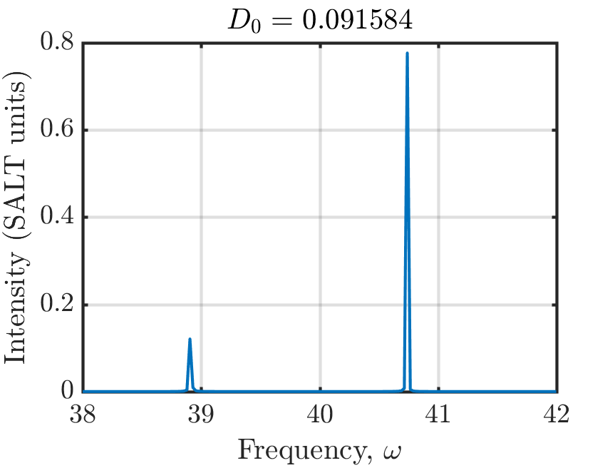

---
# Multilevel-Atomic Susceptibility
---

This tutorial demonstrates Meep's ability to model saturable gain and absorption using a multilevel atomic susceptibility. This is based on a generalization of the [Maxwell-Bloch equations](https://en.wikipedia.org/wiki/Maxwell-Bloch_equations) which involve the interaction of a quantized system having an arbitrary number of levels with the electromagnetic fields, and the exact equations Meep is using are discussed in the [Materials section](../Materials.md#saturable-gain-and-absorption). We will demonstrate this feature by computing the lasing thresholds of a two-level, multimode cavity in 1d similar to the example used in [A. Cerjan et al](https://www.osapublishing.org/oe/abstract.cfm?uri=oe-20-1-474) (Fig. 2).


First, the cavity consists of a high-index medium, $n = 1.5$, with a perfect-metallic mirror on one end and an abrupt termination in air on the other.
```scm
(set-param! resolution 400)
(define-param ncav 1.5)                          ; cavity refractive index
(define-param Lcav 1)                            ; cavity length
(define-param dpad 1)                            ; padding thickness
(define-param dpml 1)                            ; PML thickness
(define-param sz (+ Lcav dpad dpml))
(set! geometry-lattice (make lattice (size no-size no-size sz)))
(set! dimensions 1)
(set! pml-layers (list (make pml (thickness dpml) (side High))))
```
Note that the resolution for this simulation is quite large, we'll discuss this further below.

The properties of the polarization of the saturable gain are determined by the central transition frequency, $\omega_a$, its full-width half-maximum, $\Gamma$, and the coupling constant between the polarization and the electric field, $\boldsymbol{\sigma}$. In Meep, the first two of these are specified in units of $2\pi a / c$. As this example compares Meep against results found using the steady-state *ab initio* laser theory (SALT), we show explicitly how to convert between the different variable nomenclature used in each method.
```scm
(define-param omega-a 40)                        ; omega_a in SALT
(define freq-21 (/ omega-a (* 2 pi)))            ; emission frequency  (units of 2\pi a/c)

(define-param gamma-perp 4)                      ; HWHM in angular frequency, SALT
(define gamma-21 (/ (* 2 gamma-perp) (* 2 pi)))  ; FWHM emission linewidth (units of 2\pi a/c)

(define-param theta 1)                           ; off-diagonal dipole matrix element
(define sigma-21 (* 2 theta theta omega-a))      ; dipole coupling strength (hbar = 1)
```
To understand the need for the high resolution above, let us calculate the central wavelength of the transition inside the high-index cavity relative to the cavity length,
$$ \frac{\lambda}{L} = \frac{2 \pi c}{n \omega_a L} = \frac{2 \pi}{1.5 \cdot 40} \approx 0.1047 $$
i.e., the cavity contains roughly $10$ wavelengths. (Yes, this is an unphysically small cavity.) Thus, to ensure that the electric field within the cavity is properly resolved, we have chosen roughly $40$ pixels per wavelength, yielding a resolution of 400.

Next, we need to specify the non-radiative transition rates of the two-level atomic medium we're using, as well as the total number of gain atoms in the system, $N_0$. The non-radiative transition rates are specified in units of $a/c$.
```scm
(define-param rate-21 0.005)                     ; non-radiative rate  (units of a/c)
(define-param N0 37)                             ; initial population density of ground state
(define-param Rp 0.0051)                         ; pumping rate of ground to excited state
```
For a two-level atomic gain medium, the effective inversion that this choice of parameters corresponds to in SALT units can be calculated as
$$ D_0 \; (\textrm{SALT}) = \frac{|\theta|^2}{\hbar \gamma_\perp} \left( \frac{\gamma_{12} - \gamma_{21}}{\gamma_{12} + \gamma_{21}} N_0 \right) \approx 0.0916 $$
where the term in parenthesis on the right-hand side is the definition of $D_0$ in normal units, and the additional factor of $|\theta|^2 / \hbar \gamma_\perp$ converts to SALT's units.

```scm
(define two-level (make medium (index ncav)
        (E-susceptibilities (make multilevel-atom (sigma-diag 1 0 0)
          (transitions (make transition (from-level 1) (to-level 2) (pumping-rate Rp)
                             (frequency freq-21) (gamma gamma-21) (sigma sigma-21))
                       (make transition (from-level 2) (to-level 1) (transition-rate rate-21)))
          (initial-populations N0)))))

(set! geometry (list (make block (center 0 0 (+ (* -0.5 sz) (* 0.5 Lcav)))
                           (size infinity infinity Lcav) (material two-level))))			   
```
Definition of the two-level medium involves the `multilevel-atom` sub-class of the `E-susceptibilities` material type. Each radiative and non-radiative `transition` is specified separately. Note that internally, Meep treats `pumping-rate` and `transition-rate` identically, and you can use them interchangeably, but it is important to specify the `from-level` and `to-level` parameters correctly, otherwise the results will be undefined. Moreover, the choice of these parameters requires some care. For example, choosing a pumping rate that lies far beyond the first lasing threshold will yield large inversion, and thus large gain, which is not realistic, as most physical devices will overheat before reaching such a regime. (Meep will still produce accurate results in this regime though.) Additionally, choosing the total simulation time is especially important when operating near the threshold of a lasing mode, as the fields contain relaxation oscillations and require sufficient time to reach steady state.

It is also in specifying the full two-level medium that it becomes clear how $\boldsymbol{\sigma}$ is defined. When invoking the `multilevel-atom` sub-class of the `E-susceptibilities` material type, we need to specify the three components of `sigma-diag`, which is the direction $\boldsymbol{\sigma}/|\sigma|$ points in. The magnitude, $|\sigma|$, is specified in the appropriate transition by `sigma`. Internally, Meep defines $\boldsymbol{\sigma}$ as `(sigma sigma-21) * (sigma-diag 1 0 0)`. Thus, this saturable gain media will only couple to, and amplify, the $E_x$ component of the electric field.

The field within the cavity is initialized to arbitrary non-zero values and a fictitious source is used to pump the cavity at a fixed rate. The fields are time stepped until reaching steady state. Near the end of the time stepping, we output the electric field outside of the cavity.

```scm
(init-fields)
(meep-fields-initialize-field fields Ex
             (lambda (p) (if (= (vector3-z p) (+ (* -0.5 sz) (* 0.5 Lcav))) 1 0)))

(define-param endt 7000)

(define print-field (lambda () (print "field:, " (meep-time) ", "
              (real-part (get-field-point Ex (vector3 0 0 (+ (* -0.5 sz) Lcav (* 0.5 dpad))))) "\n")))
(run-until endt (after-time (- endt 250) print-field))
```

To analyze this data, we plot its spectra
<center>

</center>
where we see there are two lasing modes above threshold in the vicinity of the center transition frequency, $\omega_a = 40$, as we would expect. Remember, when finding the frequency axis that Meep uses a Courant factor of $\Delta t = 0.5 \Delta x$. Here, we have also converted the electric field to SALT units, using 
$$ \mathbf{E} \; (\textrm{SALT}) = \frac{2 |\theta|}{\hbar \sqrt{\gamma_\perp \gamma_\parallel}} \mathbf{E} \; (\textrm{Meep}) $$
with $\gamma_\parallel = \gamma_{12} + \gamma_{21}$. We can also verify that the system is not exhibiting relaxation oscillations by directly plotting the electric field as a function of time and looking for very long time-scale oscillations. In the continuum limit, these modes would appear as Dirac delta functions in the spectra. The discretized model, however, produces peaks with finite width. Thus, we need to integrate a fixed number of points around each peak to calculate the correct modal intensity. By varying $N_0$ (or $R_p$), we can change the total gain available in the cavity, and thus find the laser's modal intensities as a function of the strength of the gain, which we can compare against SALT and an independent FDTD using the Maxwell-Bloch equations to find excellent agreement both close to the first lasing threshold, 
<center>

</center>
and with much stronger gain.
<center>

</center>