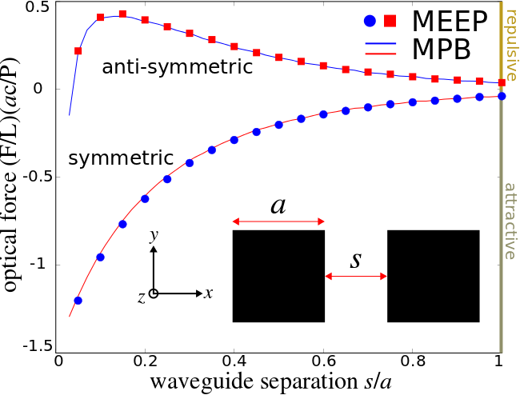

---
# Optical Forces
---

Here we will demonstrate Meep's ability to compute classical forces using the [Maxwell stress tensor](https://en.wikipedia.org/wiki/_Maxwell_stress_tensor) (MST) as well as the eigenmode source feature which integrates the mode-solver package [MPB](https://mpb.readthedocs.io). See the `parallel-wvg-force.ctl` file in the `examples/` subdirectory. Our example consists of two identical dielectric waveguides made of lossless Silicon with a square cross section supporting identical modes and separated in air. Due to the symmetry and orientation of the waveguides, the two modes can be chosen to be either symmetric or anti-symmetric with respect to a mirror plane between them. As the two waveguides are brought closer and closer together, the individual guided modes couple more and more and give rise to an optical gradient force that is <i>transverse</i> to the waveguide axis. This is to be contrasted with [radiation pressure](https://en.wikipedia.org/wiki/Radiation_pressure) that involves momentum exchange between photons and is <i>longitudinal</i> in nature. An interesting phenomena that occurs for this system is that the <i>sign</i> of the force can be tuned to be either attractive or repulsive depending on the relative phase of the two modes. We will demonstrate this effect in this tutorial.

The optical gradient force arising from the evanescent coupling of the modes of two adjacent structures can, in addition to the MST, be computed using the following [analytic expression](http://math.mit.edu/~stevenj/papers/PovinelliLo05.pdf):

$$F=-\frac{1}{\omega}\frac{d\omega}{ds}\Bigg\vert_\vec{k}U,$$

where $\omega$ is the eigenmode frequency of the coupled-waveguide system, $s$ is the separation distance between the parallel waveguides, $k$ is the conserved wave vector and $U$ is the total energy of the electromagnetic fields. By convention, negative and positive values correspond to attractive and repulsive forces, respectively. This expression has been shown to be [mathematically equivalent to the MST](http://www.opticsinfobase.org/oe/abstract.cfm?URI=oe-17-20-18116) and in this tutorial we will verify this result for the parallel-waveguide example. It is convenient to normalize the force so as to eliminate the tricky units altogether. Since the total power transmitted through the waveguide is $P=v_gU/L$ where $v_g$ is the group velocity, $L$ is the waveguide length and $U$ is defined as before, we focus instead on the force per unit length and power $(F/L)(ac/P)$ where $a$ is an arbitrary unit length and $c$ is the speed of light. This dimensionless quantity enables us to compute both the flux and the force in a single simulation.

We can therefore compute the optical gradient force in two ways, one indirect and the other direct: (1) using a mode solver (MPB), we compute the eigenmode frequency and corresponding group velocity for a mode with a fixed propagating wavevector at a number of different separation distances and then use a finite-difference scheme to evaluate the above expression, and (2) in Meep, we compute both the force using the MST and the power transmitted through the waveguide only at the frequency corresponding to the guided mode. In this particular example, we consider just the fundamental `y-odd` mode, which happens to clearly show the bi-directional features of the force.

First, let's set up the two-dimensional computational cell although since we are interested in a propagating mode of the structure which requires an axial wavevector, this will in fact be a three-dimensional simulation

```scm
 (set-param! resolution 30)
 (define-param nSi 3.45)
 (define Si (make medium (index nSi)))
 (define-param dpml 1.0)
 (define-param sx 5)
 (define-param sy 3)
 (set! geometry-lattice 
     (make lattice (size (+ sx (* 2 dpml)) (+ sy (* 2 dpml)) no-size)))
 (set! pml-layers (list (make pml (thickness dpml))))
 (define-param a 1.0) ; waveguide width
 (define-param s 1.0)  ; waveguide separation distance
 (set! geometry (list 
       (make block (center (* -0.5 (+ s a)) 0)
             (size a a infinity) (material Si))
       (make block (center (*  0.5 (+ s a)) 0)
             (size a a infinity) (material Si))))
```

There are two mirror symmetries that we can exploit to reduce the simulation size by a factor of four.

```scm
 (define-param xodd? true)
 (set! symmetries (list 
        (make mirror-sym (direction X) (phase (if xodd? -1 +1)))
        (make mirror-sym (direction Y) (phase -1))))
```

Next, we set the Bloch-periodic boundary condition in order to excite a specific guided mode of the waveguide system corresponding to a wavevector of $\pi/a$

```scm
 (define-param beta 0.5)
 (set! k-point (vector3 0 0 beta))
```

Since we do not know apriori what the eigenmode frequency will be at any given separation distance, we first excite a spectrum of frequencies using a broadband volume source in each waveguide and then determine the resonant frequency using `harminv`. The use of a Bloch periodic boundary condition in the $z$ direction will mean that the excited mode (if any) will propagate indefinitely in time which is why we stop the simulation at a fixed 200 time units after the Gaussian-pulsed sources have turned off.

```scm
 (define-param fcen 0.22)
 (define-param df 0.06)
 (set! sources (list 
         (make source (src (make gaussian-src (frequency fcen) (fwidth df))) 
                (component Ey) (center (* -0.5 (+ s a)) 0) (size a a 0))
         (make source (src (make gaussian-src (frequency fcen) (fwidth df))) 
                (component Ey) (center (* 0.5 (+ s a)) 0) (size a a 0) 
                (amplitude (if xodd? -1.0 1.0)))))
 (run-sources+ 200 
     (after-sources (harminv Ey (vector3 (* 0.5 (+ s a)) 0) fcen df)))
 (define f (harminv-freq-re (car harminv-results)))
 (print "freq:, " s ", " f "\n")
```

Once we have determined what the eigenmode frequency is, we then use this value to accurately excite the mode of interest using the `eigenmode-source` feature and also compute the force on the waveguide and the power in the guided mode only at this value. The `eigenmode-mode` feature invokes [MPB](https://mpb.readthedocs.io) via a library routine in order to compute the relevant mode of interest and subsequently imports the steady-state field profile into the Meep simulation for use as the initial amplitude of the source. This enables an efficient excitation of the relevant eigenmode of interest in the time domain to a much higher degree of accuracy than would otherwise be possible had we simply used a point-dipole source. For more details, refer to [chapter 4 of this book](http://arxiv.org/abs/1301.5366).

```scm
 (reset-meep)
 (change-sources! (list
    (make eigenmode-source
      (src (make gaussian-src (frequency f) (fwidth df)))
      (component Ey)
      (size a a 0)
      (center (* -0.5 (+ s a)) 0)
      (eig-kpoint k-point)
      (eig-match-freq? true)
      (eig-parity ODD-Y))
    (make eigenmode-source
      (src (make gaussian-src (frequency f) (fwidth df)))
      (component Ey)
      (size a a 0)
      (center (* 0.5 (+ s a)) 0)
      (eig-kpoint k-point)
      (eig-match-freq? true)
      (eig-parity ODD-Y)
      (amplitude (if xodd? -1.0 1.0)))))
 (define wvg-pwr (add-flux f 0 1
    (make flux-region (direction Z) (center 0 0) 
      (size (* 1.2 (+ (* 2 a) s)) (* 1.2 a) 0))))
 (define wvg-force (add-force f 0 1
   (make force-region (direction X) (weight +1.0) 
         (center (* 0.5 s) 0) (size 0 a))
   (make force-region (direction X) (weight -1.0) 
         (center (+ (* 0.5 s) a) 0) (size 0 a))))
 (define-param runtime 5000)
 (run-sources+ runtime)
 (display-fluxes wvg-pwr)
 (display-forces wvg-force)
```

<b>NOTE:</b> if MPB is not installed and/or linked with Meep, simply remove all lines pertaining to `changes-sources!` and the simulation will still work, though with slightly reduced accuracy.

There are two important items to note here. The first is that we have defined a <i>single</i> flux surface spanning an area slightly larger than both waveguides rather than two separate flux planes, one for each waveguide. This is because in the limit of small separation, two flux planes will overlap thus slightly complicating the analysis whereas the total power through a single flux plane need, by symmetry, only be halved in order to determine the value for just one of the two waveguides. The second point to note is that instead of defining a closed, four-sided "box" surrounding the waveguide for computing the MST, we chose instead to compute the MST along just the two $y$-oriented sides with different `weight`s to correctly sum the total force, one on each side of the waveguide since by symmetry we need not consider the force in the $y$ direction. Also, we must mention that the MST computed by Meep does not include an often-used factor of 1/2 which needs to be added in post processing in order to properly compare the results to that from the expression above. Choosing a suitable `runtime` requires some care since a large value is necessary to obtain a steady-state response but this will also lead to large Fourier-transformed fields, used to compute both the flux and the MST, which might cause instabilities in floating-point arithmetic.

We run this simulation over a range of non-zero separation distances and compare the result to that obtained from MPB which shows good agreement. The MPB data for this plot was generated using this [control file](http://ab-initio.mit.edu/~oskooi/wiki_data/parallel-wvgs-mpb.ctl) and [shell script](http://ab-initio.mit.edu/~oskooi/wiki_data/run_wvgs_mpb.sh). The plot of the MPB data was generated using this [Jupyter notebook](http://ab-initio.mit.edu/~oskooi/wiki_data/MPB_data_plot.ipynb).

<center>

</center>