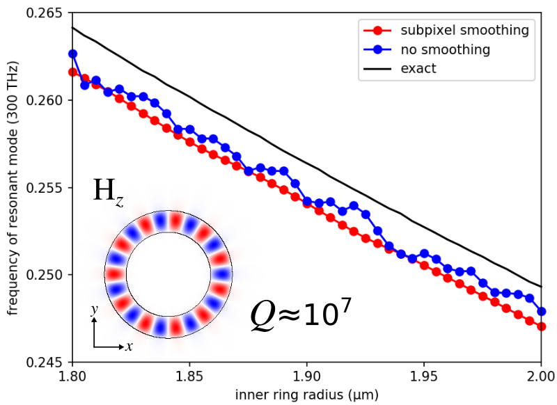
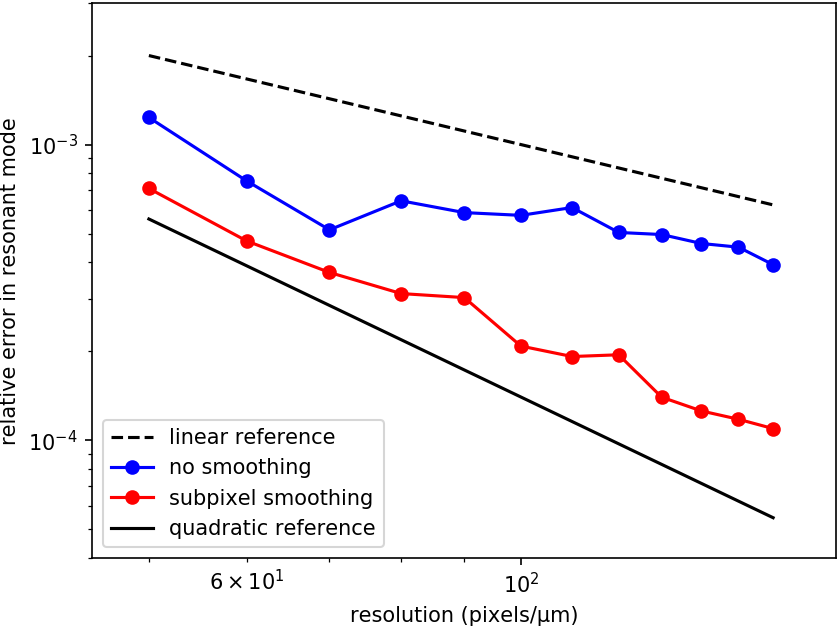

---
# Subpixel Smoothing
---

Meep uses a second-order accurate finite-difference scheme for discretizing [Maxwell's equations](Introduction.md#maxwells-equations). This means that the results from Meep converge to the "exact" result from the non-discretized system quadratically with the resolution Δx. However, this second-order error O(Δx<sup>2</sup>) is generally spoiled to first-order error O(Δx) if the discretization involves a *discontinuous* material boundary (similar to [Gibbs phenomenon](https://en.wikipedia.org/wiki/Gibbs_phenomenon) in signal processing). Moreover, directly discretizing a discontinuity in ε or μ leads to "stairstepped" interfaces that can only be varied in discrete jumps of one pixel. Meep solves both of these problems by smoothing ε and μ: before discretizing, discontinuities are smoothed into continuous transitions over a distance of one pixel Δx, using a second-order accurate averaging procedure which is summarized [below](#smoothed-permittivity-tensor-via-perturbation-theory). This feature enables the discretized solution to converge as quickly as possible to the exact solution as the `resolution` increases.

The subpixel smoothing has four limitations: (1) it only applies to frequency-independent, lossless dielectrics (i.e., silicon at λ=1.55 μm); dispersive materials are [not supported](FAQ.md#can-subpixel-averaging-be-applied-to-dispersive-materials), (2) it can be efficiently applied to [`GeometricObject`](Python_User_Interface.md#geometricobject)s (i.e. `Block`, `Prism`, `Sphere`, etc.) but *not* to a user-defined `material_function` (for an explanation, see this [FAQ](FAQ.md#can-subpixel-averaging-be-applied-to-a-user-defined-material-function)) which must be [manually enabled](#enabling-averaging-for-material-function), (3) objects with sharp corners or edges are associated with field singularities which introduce an unavoidable error intermediate between first- and second-order, and (4) the fields directly *on* the interface are still at best first-order accurate. The improved accuracy from smoothing is therefore obtained for fields evaluated off of the interface as in the [scattered Poynting flux](Python_Tutorials/Basics.md#transmittance-spectrum-of-a-waveguide-bend) integrated over a surface away from the interface, for nonlocal properties such as resonant frequencies, and for overall integrals of fields and energies to which the interface contributes only O(Δx) of the integration domain.

[TOC]

Smoothed Permittivity Tensor via Perturbation Theory
----------------------------------------------------

Any scheme for smoothing the interface perturbs the problem you are solving, and a second-order accurate smoothing scheme must mean that the perturbation's effect is zero to first order in the smoothing diameter (the resolution). This turns out to require that the smoothing scheme be anisotropic. Even if the initial interface is between isotropic materials, one obtains an effective tensor $\tilde{ε}$ (or $\tilde{μ}$) which uses the mean ε for fields parallel to the interface and the harmonic mean (inverse of mean of ε<sup>-1</sup>) for fields perpendicular to the interface:

<center>

$$ \tilde{ε}^{-1} = \textbf{P}\langleε^{-1}\rangle + \big(1-\textbf{P}\big)\langleε\rangle^{-1} $$

</center>

where $\textbf{P}$ is the projection matrix $P_{ij}=n_{i}n_{j}$ onto the normal $\vec{n}$. The $\langle\cdots\rangle$ denotes an average over the voxel $sΔx\times sΔy\times sΔz$ surrounding the grid point in question where $s$ is a smoothing diameter in grid units equal to 1/`resolution`. If the initial materials are anisotropic (via `epsilon_diag` and `epsilon_offdiag`), a more complicated formula is used. They key point is that, even if the structure consists entirely of isotropic materials, the discretized structure will use anisotropic materials. For interface pixels, Meep computes the effective permittivity tensor automatically at the start of the simulation prior to time stepping via analytic expressions for the filling fraction and local normal vector. For details involving derivation of the effective permittivity tensor and its implementation in Meep/FDTD, see [Optics Letters, Vol. 36, pp. 2972-4, 2006](https://www.osapublishing.org/ol/abstract.cfm?uri=ol-31-20-2972) and [Optics Letters, Vol. 35, pp. 2778-80, 2009](https://www.osapublishing.org/abstract.cfm?uri=ol-34-18-2778).

Continuously-Varying Shapes and Results
---------------------------------------

A key feature of Meep's subpixel smoothing, particularly relevant for shape optimization (i.e., [Applied Physics Letters, Vol. 104, 091121, 2014](https://aip.scitation.org/doi/abs/10.1063/1.4867892)), is that continuously varying the `geometry` yields continuously-varying results. This is demonstrated for a [ring resonator](Python_Tutorials/Basics.md#modes-of-a-ring-resonator): as the radius increases, the frequency of a resonant H<sub>z</sub>-polarized mode decreases. (Note: unlike the ring-resonator example in [Tutorial/Basics](Python_Tutorials/Basics.md#modes-of-a-ring-resonator) involving E<sub>z</sub>-polarized modes where the fields are always parallel to the interface, this example involves discontinuous fields. Also, the ring geometry contains no sharp corners/edges.) The simulation script is shown below. The resolution is 10 pixels/μm. The inner ring radius is varied from 1.8 to 2.0 μm in gradations of 0.005 μm.

```py
import meep as mp
import numpy as np

resolution = 10         # pixels/μm

n = 3.4                 # index of waveguide
w = 1                   # width of waveguide
pad = 4                 # padding between waveguide and edge of PML
dpml = 2                # thickness of PML

for rad in np.arange(1.800,2.001,0.005):
    sxy = 2*(rad+w+pad+dpml)  # cell size

    # pulse center frequency (from third-order polynomial fit)
    fcen = -0.018765*rad**3 + 0.137685*rad**2 -0.393918*rad + 0.636202
    # pulse frequency width
    df = 0.02*fcen

    src = [mp.Source(mp.GaussianSource(fcen, fwidth=df),
                     component=mp.Hz,
                     center=mp.Vector3(rad+0.1*w)),
           mp.Source(mp.GaussianSource(fcen, fwidth=df),
                     component=mp.Hz,
                     center=mp.Vector3(-(rad+0.1*w)),
                     amplitude=-1)]

    symmetries = [mp.Mirror(mp.X,phase=+1),
                  mp.Mirror(mp.Y,phase=-1)]

    geometry = [mp.Cylinder(radius=rad+w,
                            material=mp.Medium(index=n)),
                mp.Cylinder(radius=rad)]
    
    sim = mp.Simulation(cell_size=mp.Vector3(sxy,sxy),
                        geometry=geometry,
                        eps_averaging=True,
                        sources=src,
                        resolution=resolution,
                        symmetries=symmetries,
                        boundary_layers=[mp.PML(dpml)])

    sim.run(mp.after_sources(mp.Harminv(mp.Hz, mp.Vector3(rad+0.1), fcen, df)),
            until_after_sources=300)

    sim.reset_meep()
```

A plot of the resonant frequency versus the ring radius is shown below for subpixel smoothing (red) and no smoothing (blue). Included for reference is the high-resolution result (black) computed using *no smoothing* at a resolution of 60 pixels/μm. The no-smoothing result shows "staircasing" effects which are artifacts of the discretization. The subpixel-smoothing result varies continuously with the ring radius similar to the high-resolution result which is at a resolution six times larger. The inset shows the scalar H<sub>z</sub> field profile of the resonant mode for a structure with inner radius of 1.9 μm.

This particular resonant mode has a [quality (Q) factor](https://en.wikipedia.org/wiki/Q_factor) of ~10<sup>7</sup> at a frequency of 0.25 and radius of 2.0 μm. This means that roughly 4x10<sup>7</sup> optical periods are required to accurately resolve the field decay due to the Fourier uncertainty relation. Instead, [`Harminv`](Python_User_Interface.md#harminv) can resolve the Q using just ~1000 periods. This is nearly a four orders of magnitude reduction in the run time.

<center>

</center>

To compare the convergence rate of the discretization error, the following plot shows the error in the resonant mode frequency (relative to the high-resolution result at a resolution of 300 pixels/μm) as a function of the grid resolution for a ring geometry with a fixed radius of 2.0 μm. The no smoothing results have a linear error due to the stairstepped interface discontinuities. The subpixel smoothing results have roughly second-order convergence.

<center>

</center>

Enabling Averaging for Material Function
----------------------------------------

Subpixel smoothing is automatically applied to `GeometricObject`s as `eps_averaging` is `True` by default. For a `material_function`, because it tends to have poor performance, subpixel averaging is disabled by default. Meep has an (currently experimental) feature to enable smoothing for a `material_function` by setting its `do_averaging` property to `True` as demonstrated in the following example.

```py

def ring_resonator(p):
    rr = (p.x**2+p.y**2)**0.5
    if (rr > rad) and (rr < rad+w):
        return mp.Medium(index=n)
    return mp.air

ring_resonator.do_averaging = True

geometry = [mp.Block(center=mp.Vector3(),
                     size=mp.Vector3(sxy,sxy),
                     material=ring_resonator)]

sim = mp.Simulation(cell_size=mp.Vector3(sxy,sxy),
                    geometry=geometry,
                    subpixel_tol=1e-4,
                    subpixel_maxeval=1000,
                    sources=src,
                    resolution=resolution,
                    symmetries=symmetries,
                    boundary_layers=[mp.PML(dpml)])
```

Since the adaptive numerical integration tends to be much slower than the analytic approach, the values for the parameters `subpixel_tol` and `subpixel_maxeval` can be lowered to speed up the quadrature at the expense of reduced accuracy.
