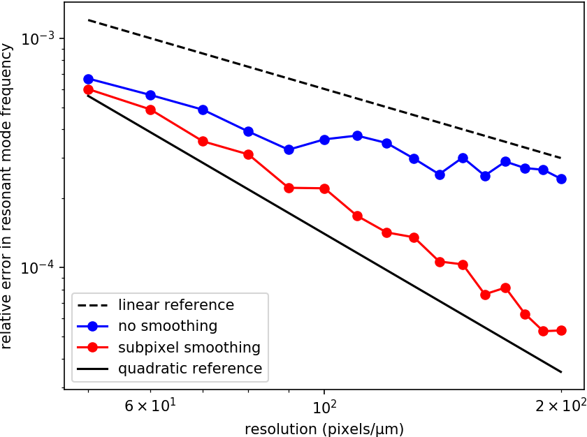
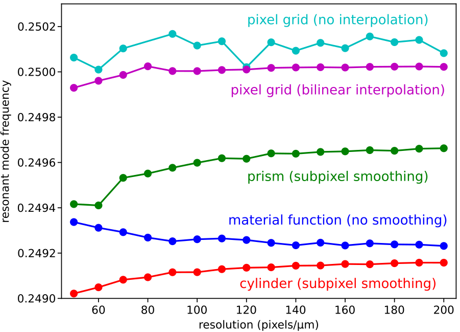
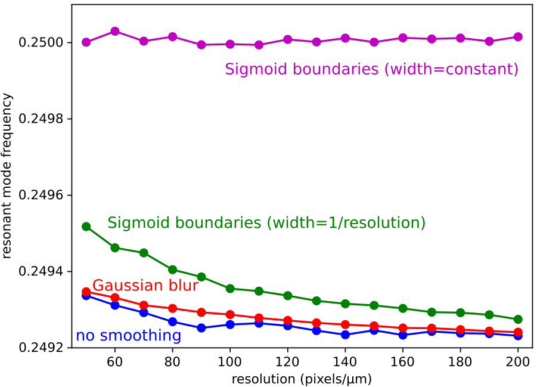

---
# Subpixel Smoothing
---

Meep uses a [second-order accurate finite-difference scheme](https://en.wikipedia.org/wiki/Finite_difference_method#Accuracy_and_order) for discretizing [Maxwell's equations](Introduction.md#maxwells-equations). This means that the results from Meep converge to the "exact" result from the non-discretized (i.e., continuous) system quadratically with the grid resolution $\Delta x$. However, this second-order error $\mathcal{O}(\Delta x^2)$ is generally spoiled to first-order error $\mathcal{O}(\Delta x)$ if the discretization involves a *discontinuous* material boundary. Moreover, directly discretizing a discontinuity in $\varepsilon$ or $\mu$ leads to "stairstepped" interfaces that can only be varied in discrete jumps of one voxel. Meep solves both of these problems by smoothing $\varepsilon$ and $\mu$: before discretizing, discontinuities are smoothed into continuous transitions over a distance of one voxel $\Delta x$, using a second-order accurate averaging procedure summarized [below](#smoothed-permittivity-tensor-via-perturbation-theory). Subpixel smoothing, illustrated in the following schematic, enables the discretized solution to converge as quickly as possible to the exact solution as the `resolution` increases.

<center>

</center>

However, subpixel smoothing has five limitations:

1. It only applies to frequency-independent, lossless dielectrics (i.e., silicon at $\lambda=1.55$ μm); dispersive materials are [not supported](FAQ.md#can-subpixel-averaging-be-applied-to-dispersive-materials). For materials with a complex-refractive index, the imaginary part is simply ignored. For materials with a frequency-dependent $\varepsilon$, only $\varepsilon_\infty$ (i.e., the infinite frequency or instantaneous response) is used. Anisotropic materials are supported.

2. It can be efficiently applied to [`GeometricObject`](Python_User_Interface.md#geometricobject)s (i.e. `Block`, `Prism`, `Sphere`, etc.) which are based on a [level-set function](https://en.wikipedia.org/wiki/Level-set_method) but [*not* to a user-defined `material function`](FAQ.md#can-subpixel-averaging-be-applied-to-a-user-defined-material-function) which is [disabled by default](#enabling-averaging-for-material-function).

3. Objects with sharp corners or edges are associated with field singularities which introduce an unavoidable error intermediate between first and second order.

4. The fields directly on the interface are still at best first-order accurate. The improved accuracy from smoothing is therefore obtained for fields evaluated off of the interface as in the [scattered Poynting flux](Python_Tutorials/Basics.md#transmittance-spectrum-of-a-waveguide-bend) integrated over a surface away from the interface, for nonlocal properties such as [resonant frequencies](Python_Tutorials/Resonant_Modes_and_Transmission_in_a_Waveguide_Cavity.md#resonant-modes), and for overall integrals of fields and energies to which the interface contributes only $\mathcal{O}(\Delta x)$ of the integration domain.

5. It is only valid when the `resolution` is fine enough such that the dielectric interfaces are locally flat within most of the voxels (i.e., the radius of curvature is much larger than the resolution Δx). At `resolution`s which are coarser than the geometric dimensions, the analytic theory breaks down and subpixel smoothing is no longer guaranteed to improve accuracy.

[TOC]

Smoothed Permittivity Tensor via Perturbation Theory
----------------------------------------------------

Any scheme for smoothing the interface perturbs the problem you are solving, as shown in the schematic above, and a second-order accurate smoothing scheme must mean that the perturbation's effect is zero to first order in the smoothing diameter (the grid resolution). This turns out to require that the smoothing scheme be anisotropic. The smoothing scheme is based on formulating an effective tensor $\tilde{\varepsilon}$ (or $\tilde{\mu}$) which uses the mean $\varepsilon$ for fields parallel to the interface and the harmonic mean (inverse of mean of $\varepsilon^{-1}$) for fields perpendicular to the interface:

<center>

$$ \tilde{\varepsilon}^{-1} = \textbf{P}\langle\varepsilon^{-1}\rangle + \big(1-\textbf{P}\big)\langle\varepsilon\rangle^{-1} $$

</center>

where $\textbf{P}$ is the projection matrix $P_{ij}=n_{i}n_{j}$ onto the normal $\vec{n}$. The $\langle\cdots\rangle$ denotes an average over the voxel $sΔx\times sΔy\times sΔz$ surrounding the grid point in question where $s$ is a smoothing diameter in grid units equal to 1/`resolution`. (This analysis assumes that the interface is approximately planar throughout the voxel, which will hold in the regime where the voxels are small compared to the geometric feature sizes.) If the initial materials are anisotropic (via `epsilon_diag` and `epsilon_offdiag`), a more complicated formula is used. The key point is that, even if the structure consists entirely of isotropic materials, the discretized structure will use anisotropic materials. Also, the smoothing will transform a discontinuous interface separating $\varepsilon_1$ and $\varepsilon_2$ into a continuously varying interface in the range [$\varepsilon_1$, $\varepsilon_2$]. For interface voxels, Meep computes the effective permittivity tensor automatically at the start of the simulation prior to time stepping via analytic expressions for the filling fraction and local normal vector. For details involving derivation of the effective permittivity tensor and its implementation in Meep/FDTD, see [Optics Letters, Vol. 36, pp. 2972-4 (2006)](https://www.osapublishing.org/ol/abstract.cfm?uri=ol-31-20-2972) and [Optics Letters, Vol. 35, pp. 2778-80 (2009)](https://www.osapublishing.org/abstract.cfm?uri=ol-34-18-2778).

Impact on Runtime Performance
-----------------------------

Simulations involving subpixel smoothing consume more memory *at the same resolution* than no smoothing because of the additional storage of an anisotropic tensor at boundary voxels.  (In fact, to enable efficient runtime processing, the additional tensor storage is required for every voxel in the enclosing rectangular "chunk" of voxels for that processor.) Each anisotropic tensor is comprised of six floating point numbers (from the symmetric 3$\times$3 matrix). By comparison, no smoothing involves storing only three floating point numbers at all grid points corresponding to the diagonal entries of $\varepsilon$ or $\mu$. Also, anisotropic tensors will tend to slow down the time-stepping rate due to the additional off-diagonal field components that need to be fetched and included when updating each field component.  On the other hand, anisotropic smoothing often allows one to use lower resolution than would be required for the same accuracy without smoothing.

In [parallel simulations](Parallel_Meep.md), each [chunk](Chunks_and_Symmetry.md) computes the effective permittivity separately for its owned voxels. This means that the time required for the grid initialization (`set_epsilon` in the output) should typically scale [linearly with the number of processors](FAQ.md#should-i-expect-linear-speedup-from-the-parallel-meep). The same is true even when subpixel smoothing is disabled.

Continuously Varying Shapes and Results
---------------------------------------

A key feature of Meep's subpixel smoothing, particularly relevant for shape optimization (i.e., [Applied Physics Letters, Vol. 104, 091121 (2014)](https://aip.scitation.org/doi/abs/10.1063/1.4867892) ([pdf](http://ab-initio.mit.edu/~oskooi/papers/Oskooi14_tandem.pdf))), is that continuously varying the `geometry` yields continuously varying results. This is demonstrated for a ring resonator: as the radius increases, the frequency of a resonant $H_z$-polarized mode decreases. Note: unlike the example in [Tutorial/Basics/Modes of a Ring Resonator](Python_Tutorials/Basics.md#modes-of-a-ring-resonator) involving $E_z$-polarized modes where the electric fields are always continuous (i.e., parallel to the interface), this example involves discontinuous fields. Also, the ring geometry contains no sharp corners/edges which tend to produce field singularities that degrade the error. The simulation script is shown below. The inner ring radius is varied from 1.8 to 2.0 μm in gradations of 0.005 μm. The ring width is constant (1 μm). The resolution is 10 voxels/μm. The gradations are therefore well below voxel dimensions.

```py
import meep as mp
import numpy as np

resolution = 10         # voxels/μm

n = 3.4                 # index of waveguide
w = 1                   # width of waveguide
pad = 4                 # padding between waveguide and edge of PML
dpml = 2                # thickness of PML

for rad in np.arange(1.800,2.001,0.005):
    sxy = 2*(rad+w+pad+dpml)  # cell size

    # pulse center frequency (from third-order polynomial fit)
    fcen = -0.018765*rad**3 + 0.137685*rad**2 -0.393918*rad + 0.636202
    # pulse frequency width
    df = 0.02*fcen

    src = [mp.Source(mp.GaussianSource(fcen, fwidth=df),
                     component=mp.Hz,
                     center=mp.Vector3(rad+0.1*w)),
           mp.Source(mp.GaussianSource(fcen, fwidth=df),
                     component=mp.Hz,
                     center=mp.Vector3(-(rad+0.1*w)),
                     amplitude=-1)]

    symmetries = [mp.Mirror(mp.X,phase=+1),
                  mp.Mirror(mp.Y,phase=-1)]

    geometry = [mp.Cylinder(material=mp.Medium(index=n),
                            radius=rad+w,
                            height=mp.inf,
                            center=mp.Vector3()),
                mp.Cylinder(material=mp.vacuum,
                            radius=rad,
                            height=mp.inf,
                            center=mp.Vector3())]
    
    sim = mp.Simulation(cell_size=mp.Vector3(sxy,sxy),
                        geometry=geometry,
                        eps_averaging=True,
                        sources=src,
                        resolution=resolution,
                        symmetries=symmetries,
                        boundary_layers=[mp.PML(dpml)])

    sim.run(mp.after_sources(mp.Harminv(mp.Hz, mp.Vector3(rad+0.1), fcen, df)),
            until_after_sources=300)

    sim.reset_meep()
```

A plot of the resonant frequency versus the ring radius is shown below for subpixel smoothing (red) and no smoothing (blue). Included for reference is the "exact" result (black) computed using *no smoothing* at a resolution of 60 voxels/μm. The no-smoothing result shows "staircasing" effects which are artifacts of the discretization. The subpixel-smoothing result varies continuously with the ring radius similar to the high-resolution result which is at a resolution six times larger. The inset shows the scalar $H_z$ field profile of the resonant mode for a structure with inner radius of 1.9 μm.

This particular resonant mode has a [quality (Q) factor](https://en.wikipedia.org/wiki/Q_factor) of ~10<sup>7</sup> at a frequency of 0.25 and radius of 2.0 μm. This means that roughly 4x10<sup>7</sup> optical periods are required to accurately resolve the field decay due to the Fourier uncertainty relation. Instead, [`Harminv`](Python_User_Interface.md#harminv) can resolve the $Q$ using just ~1000 periods. This is nearly a four orders of magnitude reduction in the run time.

<center>

</center>

To compare the convergence rate of the discretization error, the following plot shows the error in the resonant frequency (relative to the "exact" result at a resolution of 300 voxels/μm) as a function of the grid resolution for a ring geometry with a fixed inner radius of 2.0 μm. The no-smoothing results have a linear error due to the stairstepped interface discontinuities. The subpixel-smoothing results have roughly second-order convergence.

<center>

</center>

Enabling Averaging for Material Function
----------------------------------------

By default, subpixel smoothing is automatically applied to any `GeometricObject` in the cell as `eps_averaging=True` in the [`Simulation`](Python_User_Interface.md#the-simulation-class) constructor. For a `material_function` however, subpixel smoothing [tends to be slow](FAQ.md#why-does-subpixel-averaging-take-so-long) due to an adaptive numerical integration method that involves callbacks from the low-level C++ routines and the Python-defined material functions. Because of this poor performance, subpixel smoothing is disabled by default for material functions (even though subpixel smoothing is still applied to other `GeometricObjects` which do not contain a `material_function`).

Subpixel smoothing can be enabled for a `material_function` by setting its `do_averaging` property to `True` as demonstrated in the following example.

```py

def ring_resonator(p):
    rr = (p.x**2+p.y**2)**0.5
    if (rr > rad) and (rr < rad+w):
        return mp.Medium(index=n)
    return mp.air

ring_resonator.do_averaging = True

geometry = [mp.Block(center=mp.Vector3(),
                     size=mp.Vector3(sxy,sxy),
                     material=ring_resonator)]

sim = mp.Simulation(cell_size=mp.Vector3(sxy,sxy),
                    geometry=geometry,
                    subpixel_tol=1e-4,
                    subpixel_maxeval=1000,
                    sources=src,
                    resolution=resolution,
                    symmetries=symmetries,
                    boundary_layers=[mp.PML(dpml)])
```

The adaptive numerical integration used for subpixel smoothing of material functions tends to be significantly slower than the analytic approach. To speed this up at the expense of reduced accuracy, the values for its two convergence parameters `subpixel_tol` (tolerance) and `subpixel_maxeval` (maximum number of function evaluations) can be increased/lowered.

What about Dispersive Materials?
--------------------------------

Meep only does [subpixel averaging](Subpixel_Smoothing.md) of the *instantaneous* (i.e., infinite frequency) part of $\varepsilon$ and $\mu$. The dispersive part is not averaged at all (i.e., any frequency dependence of $\varepsilon$ and $\mu$ is ignored). This means that any discontinuous interfaces between dispersive materials will dominate the error, and you will probably get only first-order convergence, the same as if you do no subpixel averaging at all. Unfortunately, applying anisotropic subpixel smoothing to dispersive materials would result in a material with higher-degree frequency dependence, greatly complicating the implementation in the time domain.

It is possible that the subpixel averaging may still improve the constant factor in the convergence if not the asymptotic convergence rate, if you also have a lot of interfaces between non-dispersive materials or if the dispersion is small (i.e., if $\varepsilon$ is close to $\varepsilon_{\infty}$ over your bandwidth). On the other hand, if the dispersion is large and most of your interfaces are between large-dispersion materials, then subpixel averaging may not help at all and you might as well turn it off (which may improve [stability](#why-are-the-fields-blowing-up-in-my-simulation)). Generally, the subpixel averaging will not degrade accuracy though it will affect performance. See [Issue \#1064](https://github.com/NanoComp/meep/issues/1064).

What Happens When Subpixel Smoothing is Disabled?
-------------------------------------------------

When subpixel smoothing is disabled by either (1) setting `eps_averaging=False` in the [`Simulation`](Python_User_Interface.md#the-simulation-class) constructor or (2) using a [material function](Subpixel_Smoothing.md#enabling-averaging-for-material-function), each electric-field component $(E_x, E_y, E_z)$ in a given voxel is individually assigned a scalar permittivity (for isotropic materials) based on whatever the value of the permittivity is at that position in the [Yee grid](Yee_Lattice.md). This results in [staircasing artifacts](Subpixel_Smoothing.md) due to the discontinuous material interfaces as well as the staggered nature of the Yee grid points. Any change in the resolution which shifts the location of the Yee grid points relative to the material interfaces will result in unpredictable changes to any computed quantities. (The coordinates of the Yee grid points can be obtained using a [field function](Field_Functions.md#coordinates-of-the-yee-grid) which can be useful for debugging.)

Subpixel Smoothing vs. Bilinear Interpolation
---------------------------------------------

In certain cases, using subpixel smoothing may be impractical given the poor runtime performance of the adaptive numerical integration method as discussed previously. A partial workaround, to ensure that Meep responds continuously to changes in the simulation parameters (even if absolute accuracy is not improved) is to *interpolate* any discontinuous structure onto the Yee grid. Otherwise, tiny changes in Meep's [Yee grid](Yee_Lattice.md) due to e.g. small changes in the resolution could cause discontinuous jumps in $\varepsilon$.

As a demonstration of this effect, consider a ring resonator (inner radius: 2 μm, width: 1 μm; same structure as [above](#continuously-varying-shapes-and-results)) in which the ring geometry can be represented using five different methods:

1. two overlapping [`Cylinder`](Python_User_Interface.md#cylinder) objects (anisotropic subpixel smoothing).
2. two overlapping [`Prism`](Python_User_Interface.md#prism) objects (anisotropic subpixel smoothing).
3. [material function](Python_User_Interface.md#material-function) (no smoothing).
4. pixel grid via [`epsilon_input_file`](Python_User_Interface.md#the-simulation-class) (bilinear interpolation onto Yee grid).
5. pixel grid via `epsilon_input_file` (no smoothing).

Of these five methods, (3) and (5) produce discontinuous structures.

The pixel grid imported from the HDF5 `epsilon_input_file` in (4) and (5) is generated by the function `output_epsilon` when using the material function from (3) at a resolution of 80.

The `Prism` objects in (2) are generated using a fixed number of 40 vertices:

```py
N = 40
phis = np.linspace(0,2*np.pi,N+1)
vertices_outer = []
vertices_inner = []
for phi in phis[:-1]:
    vertices_outer.append((rad+w)*mp.Vector3(np.cos(phi),np.sin(phi),0))
    vertices_inner.append(rad*mp.Vector3(np.cos(phi),np.sin(phi),0))
geometry = [mp.Prism(vertices_outer, height=mp.inf, material=mp.Medium(index=n)),
            mp.Prism(vertices_inner, height=mp.inf, material=mp.vacuum)]
```

The following convergence plot shows the frequency for the resonant mode with $H_z$ polarization and $Q$ of ~10<sup>7</sup> as a function of resolution.

<center>

</center>

There are three important items to note. (1) The pixel grid and prism representations are each converging to a different frequency than the material function and cylinder. This is because in the limit of infinite resolution, they are *different* structures than the cylinders. (2) The material function is the same structure as the cylinder with no smoothing. In the limit of infinite resolution, the material function and cylinder converge to the same frequency. The only difference is the *rate* of convergence: the cylinder is second order (due to subpixel smoothing) whereas the material function is first order. See the convergence plot above (third figure from the top). (3) The non-interpolated pixel grid shows irregular convergence compared with the interpolated grid. This is expected because the non-interpolated grid is discontinuous but the interpolated grid is not. Also, because these are different structures the two pixel grids converge to different frequencies. To see this trend clearly requires reducing the "jumpiness" of the non-interpolated grid: the Meep resolution needs to be increased beyond 200 which is already ~3X the grid resolution.

Since the interpolated pixel grid has already been smoothed to a continuous $\varepsilon(x,y)$ function, subpixel smoothing (which is not supported for `epsilon_input_file`) is not really necessary once the Yee grid resolution exceeds the input image resolution. This can be seen in the above plot: for Meep Yee grid resolutions of 80 (equal to the pixel grid resolution of the HDF5 file) and above, the changes in the results are much smaller than those at lower resolutions. Also, higher-order interpolation schemes are not necessary because the Yee discretization is already essentially equivalent to linear interpolation.

As a practical matter, increasing the Meep resolution beyond the resolution of a non-interpolated pixel grid is not physically meaningful because this is trying to resolve the individual pixels of an imported image. In the case of a pixel grid imported via `epsilon_input_file`, this is not an issue because the bilinear interpolation is performed automatically by default. However, no built-in interpolation is provided for a material function; it must be provided by the user (i.e., convolving the discontinuous material function with a smoothing kernel as demonstrated [below](#interpolation-techniques-for-material-function)). As a corollary, when designing structures using a pixel grid (e.g., as in the [adjoint solver](Python_Tutorials/Adjoint_Solver.md)), the pixel density of the degrees of freedom should typically be at least as big as the Meep resolution if not greater.

In terms of runtime performance, for structures based on a frequency-independent permittivity, anisotropic subpixel smoothing will generally consume more memory (due to the additional off-diagonal elements of the permittivity tensor) and have a slower time-stepping rate (again due to the anisotropic permittivity tensor which couples different field components during the field updates) than a simple scalar interpolation technique. The gains in accuracy from the anisotropic smoothing though should far outweigh this small performance penalty.

In general, by making a discontinuous structure continuous, via subpixel smoothing or some other form of interpolation, the convergence becomes more regular (the results change more continuously to changes in resolution or other parameters), although it does not necessarily become more accurate compared to the desired infinite-resolution structure unless the full anisotropic smoothing is performed. If the initial structure is already continuous, no additional preprocessing is necessary.

Interpolation Techniques for Material Function
----------------------------------------------

There are an arbitrary number of ways that a discontinuous material function can be made continuous in preprocessing. As an example, two different types of interpolation techniques (discrete vs. analytical) are demonstrated for the ring resonator: (1) image processing based on a [Gaussian blur](https://en.wikipedia.org/wiki/Gaussian_blur) and (2) using a [Sigmoid function](https://en.wikipedia.org/wiki/Sigmoid_function) to smooth the step function boundaries.

In the first approach, the [`scipy.ndimage.gaussian_filter`](https://docs.scipy.org/doc/scipy/reference/generated/scipy.ndimage.gaussian_filter.html) is applied to a subpixel permittivity grid generated from the material function. The subpixel grid consists of a 5x5 array of points and the smoothing radius is equal to the size of the pixel (i.e., it is resolution dependent).

```py
import numpy as np
from scipy.ndimage import gaussian_filter

dxy = 1/resolution        # smoothing kernel radius
Nxy = 5                   # smoothing grid pixel density

def smooth_ring_resonator(p):
    cx = np.linspace(p.x-0.5*dxy,p.x+0.5*dxy,Nxy)
    cy = np.linspace(p.y-0.5*dxy,p.y+0.5*dxy,Nxy)
    n_local = np.zeros((Nxy,Nxy))
    for i in range(Nxy):
        for j in range(Nxy):
            n_local[i,j] = ring_resonator(mp.Vector3(cx[i],cy[j]))
    if np.sum(n_local) == Nxy**2:
        return mp.air
    elif np.sum(n_local) == n*Nxy**2:
        return mp.Medium(index=n)
    else:
        return mp.Medium(index=np.mean(gaussian_filter(n_local, sigma=1, mode='nearest')))

geometry = [mp.Block(center=mp.Vector3(),
                     size=mp.Vector3(sxy,sxy),
                     material=smooth_ring_resonator)]
```

In the second approach, the step function boundaries (inner and outer radius of the ring resonator) are analytically smoothed using a Sigmoid function. This method tends to be faster than the discrete approach since it requires fewer function evaluations. The smoothing width `dr` can be either resolution dependent or a fixed constant; both types will be demonstrated.

```py
import numpy as np

dr = 1/resolution         # smoothing kernel width
b = 5                     # turn on/off strength

def ring_resonator(p):
    rr = (p.x**2+p.y**2)**0.5
    if (rr > rad-0.5*dr) and (rr < rad+0.5*dr):
        return mp.Medium(index=1+(n-1)/(1+np.exp(-b*(rad-rr))))
    elif (rr > rad+w-0.5*dr) and (rr < rad+w+0.5*dr):
        return mp.Medium(index=1+(n-1)/(1+np.exp(b*(rad+w-rr))))
    elif (rr >= rad+0.5*dr) and (rr <= rad+w-0.5*dr):
        return mp.Medium(index=n)
    else:
        return mp.air

geometry = [mp.Block(center=mp.Vector3(),
                     size=mp.Vector3(sxy,sxy),
                     material=ring_resonator)]
```

The plot of the resonant mode frequency with resolution is shown in the figure below. There are two items to note: (1) three structures — "no smoothing", "Gaussian blur", and Sigmoid smoothed with pixel-sized smoothing width (`dr = 1/resolution`) labeled "Sigmoid boundaries (width=1/resolution)" — are converging to the same frequency. This is expected because the smoothing radius/width is going to zero as the resolution approaches infinity and thus the two smoothed structures are converging to the same discontinuous structure. The effect of the smoothing has been to make the convergence more regular compared with no smoothing. The Sigmoid-smoothed structure has the slowest convergence rate of the three. (2) The Sigmoid-smoothed structure with constant smoothing width (`dr = 0.05`) labeled "Sigmoid boundaries (width=constant)" is converging to a different frequency than the other three structures because it is a different structure.

<center>

</center>

Finally, it is worth mentioning that a Gaussian blur (which provides only first-order accuracy) would probably be slower than doing the second-order accurate anisotropic smoothing using a [level set](https://en.wikipedia.org/wiki/Level_set) since the smoothing (e.g., via a Sigmoid function) as well as the normal vector can be computed analytically for the level set (see [\#1229](https://github.com/NanoComp/meep/issues/1229)).
