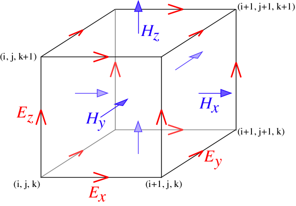
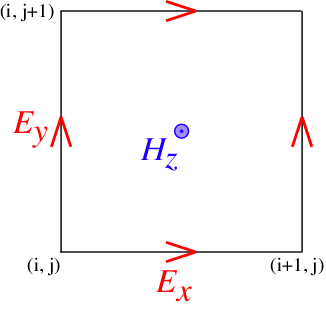

---
# Yee Lattice
---

In order to discretize Maxwell's equations with second-order accuracy for homogeneous regions where there no discontinuous material boundaries, FDTD methods *store different field components for different grid locations*. This discretization is known as a **Yee lattice**.

The form of the Yee lattice in 3d is shown in the illustration above for a single cubic grid voxel ($Δ x \times Δ x \times Δ x$). The basic idea is that the three components of **E** are stored for the *edges* of the cube in the corresponding directions, while the components of **H** are stored for the *faces* of the cube.

More precisely, let a coordinate $(i,j,k)$ in the grid correspond to:

$$\mathbf{x} = (i \hat{\mathbf{e}}_1 + j \hat{\mathbf{e}}_2 + k \hat{\mathbf{e}}_3) Δ x$$,

where $\hat{\mathbf{e}}_k$ denotes the unit vector in the *k*-th coordinate direction. Then, the $\ell$th component of $\mathbf{E}$ or $\mathbf{D}$ (or $\mathbf{P}$) is stored for the locations

$$(i,j,k)+ \frac{1}{2} \hat{\mathbf{e}}_\ell  Δ x$$.

The $\ell$th component of $\mathbf{H}$, on the other hand, is stored for the locations

$$(i+\frac{1}{2},j+\frac{1}{2},k+\frac{1}{2})-\frac{1}{2} \hat{\mathbf{e}}_\ell  Δ x$$.

In two dimensions, the idea is similar except that we set $\hat{\mathbf{e}}_3=0$. The 2d Yee lattice for the <i>P</i>-polarization (**E** in the *xy* plane and **H** in the *z* direction) is shown in the figure below.  

The consequence of the Yee lattice is that, whenever you need to compare or combine different field components, e.g. to find the energy density $(\mathbf{E}^* \cdot \mathbf{D} + |\mathbf{H}|^2)/2$ or the flux $\textrm{Re}\, \mathbf{E}^* \times \mathbf{H}$, then the components need to be **interpolated** to some common point in order to remain second-order accurate. Meep automatically does this interpolation for you wherever necessary &mdash; in particular, whenever you compute energy density or flux, or whenever you output a field to a file, it is stored for the locations $(i+0.5,j+0.5,k+0.5)$: the centers of each grid voxel.
